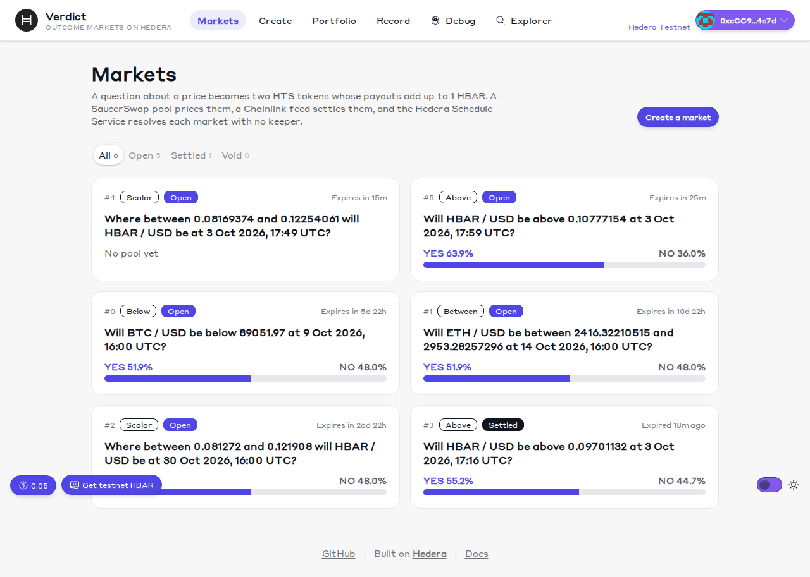
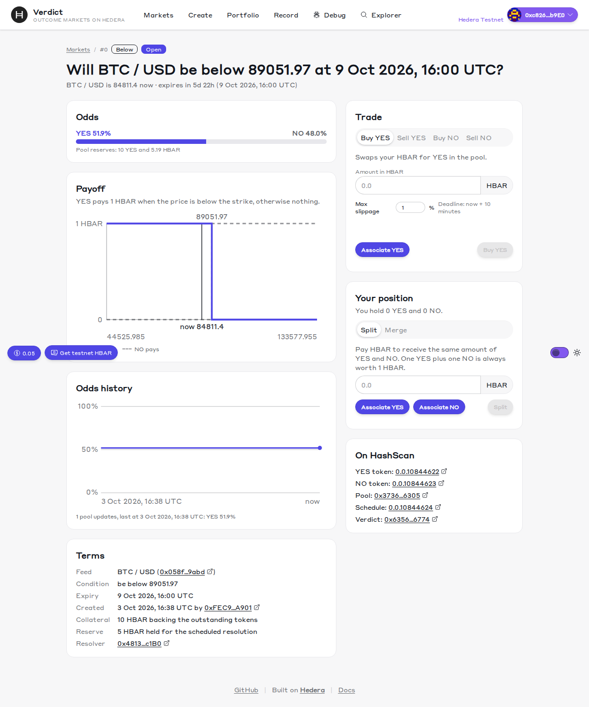
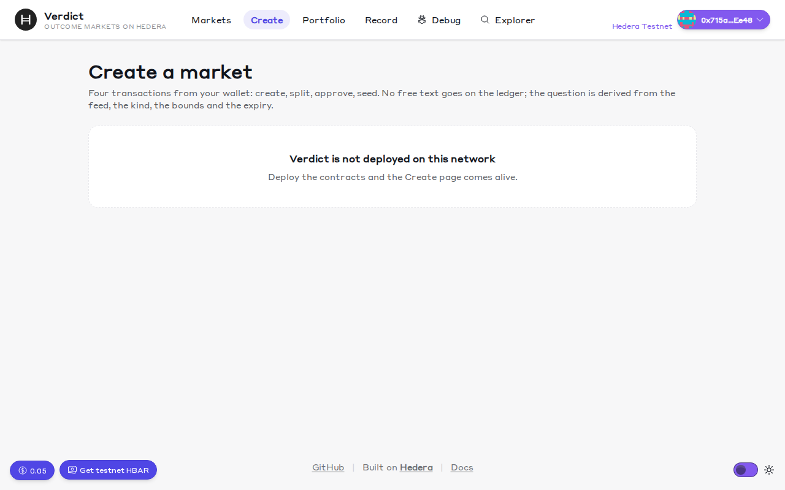
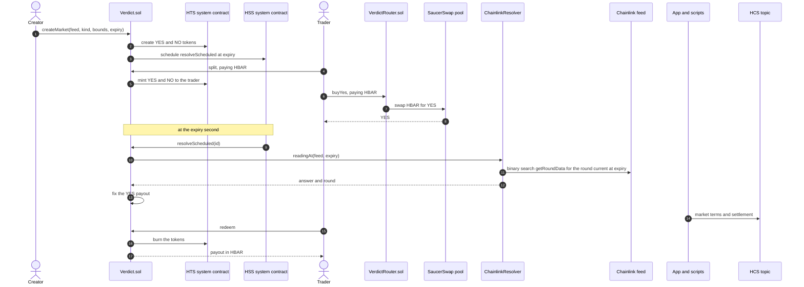
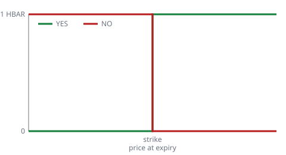
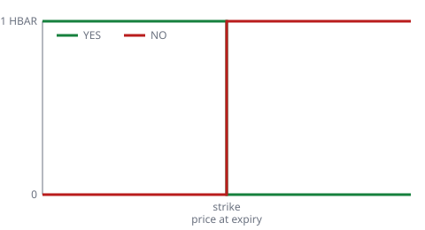
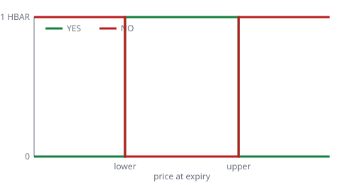
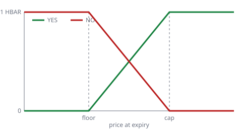

# Verdict

Verdict is a [Scaffold-HBAR](https://docs.hedera.com/solutions/tools/scaffold-hbar) template for outcome markets on Hedera: markets where people trade on what a price will be at a set time. Each market asks one question, such as "Will HBAR/USD be above 0.12 at 16:00 UTC on Friday?", and issues two tokens, YES and NO, that together always pay out exactly 1 HBAR. A SaucerSwap pool prices the tokens, a Chainlink price feed supplies the answer, and Hedera's own scheduler settles each market at its expiry with no keeper (the bot or server you would otherwise run to send that transaction).

What you get:

- **Outcome tokens on the Hedera Token Service (HTS).** HTS is Hedera's built-in token system. The contract creates, mints and burns YES and NO through it instead of deploying an ERC-20 contract per token, and it handles what that takes from Solidity: response codes, `int64` amounts and token association.
- **Settlement with no keeper.** Each market books its own settlement call with the Hedera Schedule Service (HSS) when it is created, and the network runs that call at the expiry second. The template includes the capacity checks, the fee reserve and the timing fix that the live network needed.
- **The price at expiry, not the price when someone gets round to it.** The Chainlink resolver finds the price round that was current at the expiry second by searching the feed's history, so it does not matter when settlement runs.
- **One transaction per trade.** A router buys and sells both YES and NO against a SaucerSwap V1 pool in one transaction each, and it sits outside the contract that holds the money.
- **A public audit trail.** Every market's terms and result go to a Hedera Consensus Service (HCS) topic, built from on-ledger events. A JSON API and `/llms.txt` let agents read markets and trade.
- **A working app on first run.** The market list, market pages with odds history, a guided Create page, a portfolio and the record page show live Hedera testnet markets before you deploy anything.
- **Tests and evidence.** 136 contract tests against local stand-ins for HTS and HSS, property tests for the collateral rules, CI, and measured gas and HBAR for every step on testnet.

```bash
npm create scaffold-hbar@latest -- --template resistingdestiny/verdict
```


## Evidence at a glance

Everything in this table is live on Hedera testnet, and each HashScan link (HashScan is Hedera's public explorer) opens the record on the ledger. The rows belong to deployment v2, the current one: deployment v1 exposed a timing bug in scheduled settlement that v2 fixes, and [docs/EVIDENCE.md](docs/EVIDENCE.md) has both. All three contracts are verified on Sourcify, so HashScan shows their source. Gas and HBAR for every step are in [docs/EVIDENCE.md](docs/EVIDENCE.md) and [docs/COSTS.md](docs/COSTS.md).

| What | HashScan |
| --- | --- |
| `Verdict` (markets, HTS outcome tokens, HSS scheduling, collateral) | [0x6356954dd331b19F5228F2EdF6029951416C6774](https://hashscan.io/testnet/contract/0x6356954dd331b19F5228F2EdF6029951416C6774) |
| `VerdictRouter` (four SaucerSwap trades in one transaction each) | [0xE7fa06DD77F0F514c6313F57b02427734d3B84DB](https://hashscan.io/testnet/contract/0xE7fa06DD77F0F514c6313F57b02427734d3B84DB) |
| `ChainlinkResolver` (settlement reading at the expiry second) | [0x4813A2028700B85f6529F76e2a276ad141b8c1B0](https://hashscan.io/testnet/contract/0x4813A2028700B85f6529F76e2a276ad141b8c1B0) |
| A market resolved by the Hedera Schedule Service with no account sending the transaction | [scheduled transaction](https://hashscan.io/testnet/transaction/0.0.7314364-1791047131-574357351), [schedule entity](https://hashscan.io/testnet/schedule/0.0.10844890) |
| A scalar market settled by its schedule at a fractional payout (0.50006916 HBAR per YES) | [scheduled transaction](https://hashscan.io/testnet/transaction/0.0.7314364-1791047922-812032992) |
| Pool creation on SaucerSwap V1 and a `buyNo` trade (split plus swap in one transaction) | [pool](https://hashscan.io/testnet/transaction/0xb1cd9fe3b016186056e871a219afe96b3bb8cbe2c24528333d676a000e189c74), [buyNo](https://hashscan.io/testnet/transaction/0x928a01c7ab8d5f9d93e03e56c99cf5cf06a23db8fcad99f3a7f9a68a1b288f3f) |
| HCS record topic with `market_created` and `market_settled` messages | [topic 0.0.10844607](https://hashscan.io/testnet/topic/0.0.10844607) |
| Markets open through judging: BTC / USD Below (9 Oct), ETH / USD Between (14 Oct), HBAR / USD Scalar (30 Oct) | shown live on the home page of a fresh scaffold |

## Quickstart

This gets the app running against the live testnet markets. You need Node 20.18.3 or later. You do not need a wallet, a Hedera account or any environment variables.

```bash
npm create scaffold-hbar@latest verdict -- --template resistingdestiny/verdict
cd verdict
yarn install
yarn next:dev
```

Open http://localhost:3000. Markets load straight away because the template ships with the addresses of a reference deployment on Hedera testnet, in `packages/nextjs/contracts/deployedContracts.ts`. If port 3000 is taken, start the app with `yarn next:dev -p 3010` instead.

The scaffolder asks a few questions. To answer them all up front, pass each one as a flag:

```bash
npm create scaffold-hbar@latest verdict -- \
  --template resistingdestiny/verdict \
  --frontend nextjs-app \
  --solidity-framework hardhat \
  --network testnet \
  --package-manager npm \
  --skip-hedera-skills \
  --yes
```

Keep the `--` before `--template`. Without it, npm treats the flags as its own and the scaffolder never sees them.

The project works with Yarn and with npm. This README uses Yarn. If you scaffolded with npm, replace the `yarn` prefix with `npm run` in each command, and use `npm install --legacy-peer-deps` where it says `yarn install`.

## Screens

Three pages from the running app, as the Playwright route checks capture them at 1280 px wide.



The home page lists every market on the reference deployment as a card, with its kind, status, time to expiry and the current odds from its pool.



A market page shows the odds and pool reserves, the payoff diagram with the current price marked, the odds history read from the mirror node, the market's terms, and the trade, split and merge panels with association buttons and HashScan links for every token, pool and schedule.



The Create page walks through the four wallet transactions in order (create, split, approve, seed) and shows the live feed price, the derived question and the creation cost before you sign anything.

## Deploy your own

Deploy your own copy when you want to create markets or change the contracts. The three contracts take about 40 seconds and 5 HBAR to deploy. Each market then costs about 30 HBAR, and each pool about 20 HBAR plus the liquidity you put in. All of this happens on Hedera testnet, the public test network, where HBAR comes free from a faucet and has no value.

Prerequisites:

- Node 20.18.3, pinned in `.nvmrc`
- Yarn through Corepack: `corepack enable`
- A funded Hedera testnet account. Create one at [portal.hedera.com](https://portal.hedera.com); the portal faucet refills to 1,000 HBAR once every 24 hours

### 1. Give the deploy a funded key

The deploy needs an account that can pay. There are two ways to provide its key:

- **You already have a funded testnet key**, for example from portal.hedera.com, as a `0x`-prefixed ECDSA private key. Put it in `packages/hardhat/.env` as `DEPLOYER_PRIVATE_KEY` and skip the account scripts. The deploy and every hand-run script read this plain key without asking for a password.
- **You have no key yet.** Run `yarn hardhat:account:generate`. It writes an encrypted key to `packages/hardhat/.env` and prints its address. Fund that address at [portal.hedera.com](https://portal.hedera.com) before you deploy. `yarn hardhat:deploy:testnet` then asks for the password. The hand-run testnet scripts cannot decrypt this form, so they need the plain key as well.

### 2. Set environment variables

Each package has an `.env.example`. Copy it to `.env` (in `packages/nextjs`, to `.env.local`) and fill in what you need. `.env` files are git-ignored; never commit one. The app boots and every page renders with none of these set. They are needed only to deploy and to write the HCS record.

Three terms appear in the table. The JSON-RPC relay is the service that lets Ethereum tools such as Hardhat, viem and wallets talk to Hedera; the public testnet relay is `https://testnet.hashio.io/api`. The mirror node is Hedera's public REST API for history: past transactions, contract logs, token holdings and topic messages. The operator is the Hedera account that owns the HCS topic and pays to post messages to it; the deployer account works once it exists.

| Variable | File | Required | Purpose |
| --- | --- | --- | --- |
| `DEPLOYER_PRIVATE_KEY` | `packages/hardhat/.env` | To deploy, this or the encrypted form. The hand-run testnet scripts need this plain form | Plain ECDSA private key for scripted deploys |
| `DEPLOYER_PRIVATE_KEY_ENCRYPTED` | `packages/hardhat/.env` | To deploy, this or the plain form | Encrypted key written by the account scripts |
| `HEDERA_RPC_URL` | `packages/hardhat/.env` | No | Relay override; the public testnet relay is the default |
| `HEDERA_OPERATOR_ID` | `packages/hardhat/.env` and `packages/nextjs/.env.local` | No | Account that owns the HCS topic and submits records |
| `HEDERA_OPERATOR_KEY` | `packages/hardhat/.env` and `packages/nextjs/.env.local` | No | Key for HCS submissions. Without it `/api/record` answers 503 and the rest of the app works |
| `NEXT_PUBLIC_WALLET_CONNECT_PROJECT_ID` | `packages/nextjs/.env.local` | No | WalletConnect project id for wallet connections |
| `NEXT_PUBLIC_HEDERA_TESTNET_RPC_URL` | `packages/nextjs/.env.local` | No | Relay override for the frontend on testnet |
| `NEXT_PUBLIC_HEDERA_MAINNET_RPC_URL` | `packages/nextjs/.env.local` | No | Relay override for the frontend on mainnet |
| `NEXT_PUBLIC_MIRROR_NODE_URL` | `packages/nextjs/.env.local` | No | Mirror node override; the public mirror node for the target network is the default |

The scripts and tests also read a few optional settings. Put them in front of the command (`NAME=value yarn ...`) or in `packages/hardhat/.env`:

| Setting | Read by | Default | What it does |
| --- | --- | --- | --- |
| `VERDICT_APP_URL` | `agent-trade`, `record-sync`, `e2e-testnet` | `http://localhost:3000` | Where the running app serves the API |
| `HEDERA_MIRROR_URL` | the testnet scripts | `https://testnet.mirrornode.hedera.com` | Mirror node the scripts read |
| `HCS_TOPIC_ID` | `record-sync`, `e2e-testnet` | `hcsTopicId` in `packages/nextjs/verdict.config.ts` | Topic the record is written to |
| `VERDICT_ADDRESS` | `record-sync` | the `Verdict` address in `deployedContracts.ts` | Contract whose markets are recorded |
| `RECORD_RESEND` | `record-sync` | none | Comma-separated market ids whose `market_created` message is posted again |
| `TOKEN_CREATE_VALUE` | the deploy | `2000000000` (20 HBAR) | Amount in tinybars the contract sends with each HTS token creation |
| `GUARDED` | the deploy | unset | `1` also deploys `GuardedResolver` on Hedera testnet and allows it on Verdict (see [A second oracle](#a-second-oracle-guardedresolver)) |
| `RESOLVER` | `create-market` | `chainlink` | `guarded` creates the market against the deployed `GuardedResolver` |
| `E2E_MARKET_MINUTES`, `E2E_MIN_BALANCE_HBAR` | `e2e-testnet` | `10`, `150` | Minutes until the test market expires; the balance below which the run stops |
| `REF_ONLY`, `REF_SPLIT_HBAR`, `REF_LIQUIDITY_HBAR`, `REF_MIN_BALANCE_HBAR` | `reference-deployment` | all markets, `20`, `10`, `150` | Which reference markets to create (comma-separated keys such as `btc-below,eth-between`), the HBAR split and pooled per market, and the balance floor |
| `MARKETS`, `VERDICT` | `recover-markets` | none; the `Verdict` in `packages/hardhat/deployments/hederaTestnet` | Market ids to recover, and a contract address override |
| `HEDERA_FORKING` | `hardhat.config.ts` | unset | `true` makes the local network fork Hedera testnet; `yarn hardhat:fork` sets it |
| `VERDICT_PROPERTY_RUNS`, `VERDICT_PROPERTY_SEED` | the property tests | `1000`, random | Number of random sequences, and a seed that replays a run |
| `PLAYWRIGHT_PORT` | `yarn next:test:e2e` | `3030` | Port the built app is served on for the route checks |

### 3. Test and deploy

```bash
yarn hardhat:test            # 136 tests on local mocks, about 30 seconds
yarn hardhat:deploy:testnet  # about 40 seconds and 5 HBAR
```

The deploy script deploys `Verdict`, `ChainlinkResolver` and `VerdictRouter`; with `GUARDED=1` it also deploys `GuardedResolver`, described [below](#a-second-oracle-guardedresolver). It then rewrites `packages/nextjs/contracts/deployedContracts.ts` for chain 296 (Hedera testnet), so the app shows your deployment and your markets instead of the reference ones. If the operator variables are set, it also creates the HCS record topic and writes the topic id into `packages/nextjs/verdict.config.ts`. Without them it skips that step, and you can create the topic later with `yarn record:create-topic`.

### 4. Verify the contracts

Verification publishes the source code, so HashScan can show it next to the contract.

```bash
yarn hardhat:verify-all      # Sourcify, idempotent, reads packages/hardhat/deployments
```

`yarn hardhat:verify-all` also appends rows to `docs/EVIDENCE.md` and `docs/COSTS.md` and keeps a checkpoint in `packages/hardhat/.testnet-run.json` (git-ignored). Discard the docs changes if you do not want them.

### 5. Create and seed a first market

A new market has no price until someone seeds a pool for it. The Create page at http://localhost:3000/create walks you through both. It shows the live feed price, you pick a kind, bounds and an expiry, it estimates the cost, and then it runs create, split, approve and seed in order.

From the command line the same steps are three scripts. Run them from the repo root and pass their inputs as environment variables (this form works under Yarn and npm):

```bash
FEED=HBAR/USD KIND=Above LOWER=0.10 EXPIRY=2026-10-09T16:00:00Z yarn hardhat:create-market

ID=0 SPLIT=20 LIQUIDITY=10 yarn hardhat:seed-pool

ID=0 TRADE=buyYes AMOUNT=1 yarn hardhat:trade
```

- `create-market` prints the market id, the YES and NO tokens and the resolution schedule, with HashScan links. A fresh deployment's first market is id 0, which you pass as `ID` to the next two scripts. Bounds are in human units (`0.10` is 10 cents), and the script converts them with the feed's decimals.
- `seed-pool` splits `SPLIT` HBAR into YES and NO, seeds the pool with that many whole YES against `LIQUIDITY` HBAR, and pays the pool creation fee. It prints nothing for a few minutes while the relay confirms each step.
- `trade` runs any of the four trades (`buyYes`, `sellYes`, `buyNo`, `sellNo`) with a 2 percent slippage bound.

Two things to know before seeding. `createMarket` is sent 45 HBAR, charges the two HTS token creation fees plus a resolution reserve that pays for the scheduled settlement (about 30 HBAR in all), and refunds the rest. And seeding a pool leaves you holding the NO tokens from the split, which is a position in the market like any other.

Once markets have finished, `MARKETS=0 yarn hardhat:recover-markets` gets the deployer's HBAR back: it resolves by hand any listed market that is past expiry and still open, removes the deployer's pool liquidity and redeems its YES and NO.

### 6. Check the result

Run `curl http://localhost:3000/api/markets/0`, or open `/market/0` in the running app. If a step fails, the [Troubleshooting](#troubleshooting) tables below give the cause and the fix for the failures you are most likely to meet.

## How it works

A market asks a question about one price feed at one moment. It settles on a single number, the YES payout, which is between 0 and 1 HBAR. One NO token always pays 1 HBAR minus what one YES token pays, so a YES and a NO together are always worth exactly 1 HBAR. That is why the contract can back every pair with exactly the 1 HBAR it took in when the pair was created.



Hedera exposes its native services to Solidity as system contracts at fixed addresses: HTS at `0x167` and HSS at `0x16b`. The diagram shows `Verdict.sol` calling them like any other contract.

One market, end to end:

1. **Create.** A creator asks whether HBAR/USD will be above 0.12 at 16:00 UTC next Friday. `createMarket` has the Hedera Token Service create the YES and NO tokens. The contract is their treasury (the account that holds new supply) and their only supply key (the key allowed to mint and burn). It also books its own `resolveScheduled` call for the expiry with the Hedera Schedule Service.
2. **Split and merge.** Until expiry, anyone can pay 1 HBAR to `split` and receive 1 YES and 1 NO, or hand back one of each to `merge` and receive 1 HBAR.
3. **Seed.** The creator splits 20 HBAR and seeds a SaucerSwap pool with 20 YES against 10 HBAR, so YES opens at 0.5 HBAR. That price is the market's first odds: an even chance.
4. **Trade.** Traders buy and sell YES and NO through the router, and the pool price moves with their trades.
5. **Settle.** At the expiry second the scheduled call runs with no account sending it. It reads the Chainlink round that was current at that second and fixes the YES payout. If the feed has no fresh round, nobody can resolve, and 24 hours later anyone can call `voidMarket`, which fixes the payout at 0.5 HBAR.
6. **Redeem.** Holders call `redeem`. Each YES burns for the payout and each NO for 1 HBAR minus the payout.
7. **Record.** The market terms and the settlement reading are posted to an HCS topic that anyone can read through the mirror node.

## The four market kinds

All four kinds share one mechanism; only the payoff rule differs. The strike, floor and cap are the market's `lower` and `upper` bounds, stored in the feed's own decimals (8 for the Chainlink USD feeds used here, so 0.12 is stored as 12,000,000). The diagrams show what one YES and one NO pay across the price at expiry.

**Above.** YES pays 1 HBAR when the answer is greater than the strike, otherwise nothing.



**Below.** YES pays 1 HBAR when the answer is less than the strike, otherwise nothing.



**Between.** YES pays 1 HBAR when the answer is at or above the lower bound and below the upper bound, otherwise nothing.



**Scalar.** YES pays a share of 1 HBAR that rises in a straight line from nothing at the floor to all of it at the cap: `(answer - floor) / (cap - floor)`, clamped to the range.



## What each Hedera service does here

Verdict uses three Hedera services, plus the mirror node for reading history. HTS creates the tokens. HSS lets a contract book a call for a future time that the network then runs by itself, which is why no keeper is needed. HCS is an append-only public message log, organised in topics. The table says what each one does in Verdict and where.

| Service | Role in Verdict | Where |
| --- | --- | --- |
| Hedera Token Service (HTS) | Creates the YES and NO tokens for every market, mints on split, burns on merge and redeem. The contract is treasury and holds the only supply key; there are no admin, freeze, KYC, wipe, pause or fee keys. The app offers one-click association through each token's own address (HIP-719; HIPs are Hedera Improvement Proposals). | `packages/hardhat/contracts/Verdict.sol`, `packages/nextjs/components/AssociateButton.tsx` |
| Hedera Schedule Service (HSS) | Each market schedules its own `resolveScheduled` call at creation. The scheduled call fires at the expiry second with no keeper and no account sending it. | `packages/hardhat/contracts/Verdict.sol`, `packages/hardhat/contracts/interfaces/IHederaScheduleService.sol` |
| Hedera Consensus Service (HCS) | One topic is the public record of every market's terms and settlement, written from ledger data and readable by anyone. | `packages/nextjs/app/api/record`, `packages/nextjs/app/record`, `packages/hardhat/scripts/record-sync.ts` |
| Exchange rate system contract (`0x168`) | Converts SaucerSwap's pool creation fee, which is set in tinycents (hundred-millionths of a US cent), into tinybars, on the Create page and in the seed script. | `packages/nextjs/app/create/page.tsx`, `packages/nextjs/contracts/externalContracts.ts`, `packages/hardhat/scripts/lib/testnetMarket.ts` |
| Mirror node | Serves every read the app cannot get from contract views: odds history from the pool's `Sync` events, association checks, the record feed and the transaction data behind record messages. | `packages/nextjs/lib/mirror.ts`, `packages/nextjs/lib/odds.ts` |

Two Hedera ideas come up throughout. **Association**: on Hedera an account must opt in to a token before it can hold it. That opt-in is called association. An account can also keep automatic association slots, which opt it in on first receipt. **Units**: inside contracts, HBAR amounts are tinybars, with 8 decimals (1 HBAR is 100,000,000 tinybars). Wallets and the relay show HBAR with 18 decimals, like ether, in units called weibars. The app converts between the two in one place, `packages/nextjs/lib/format.ts`.

## Why each integration is load-bearing

**SaucerSwap.** SaucerSwap is a decentralised exchange (DEX) on Hedera, and Verdict uses its V1 pools, which price two tokens by the ratio of their reserves. The pool is what gives a market a price. The contract alone can split, merge, settle and redeem, but it cannot say what YES is worth: the YES and HBAR reserves in the pool are the market's odds, shown on every market page and returned by the API. All four trades go through the pool, so without it nobody can enter or leave a position before expiry. Take SaucerSwap away and what is left is a kiosk that swaps HBAR for YES and NO pairs and back, answering a question nobody can trade on.

**Chainlink.** A Chainlink price feed supplies the one number every market settles on. Without a feed nothing can resolve: each market waits 24 hours past expiry and takes the void path, which pays 0.5 HBAR per YES and per NO whatever the question was. Chainlink feeds on Hedera testnet keep their round history, which lets the resolver look up the price that was current at the expiry second rather than the price at whatever moment someone sends a transaction. That is what makes keeper-free settlement fair: the answer is the same whenever the scheduled call runs and whoever calls `resolve`.

### A second oracle: GuardedResolver

`packages/hardhat/contracts/resolvers/GuardedResolver.sol` is a second resolver, added with no change to `Verdict.sol`: it implements `IResolver`, the owner allows it with `setResolver`, and a market picks it at creation. It wraps `ChainlinkResolver` and the Supra push oracle on Hedera testnet (`0x6Cd59830AAD978446e6cc7f6cc173aF7656Fb917`, in `config/addresses.ts`). It passes on a reading only when Chainlink has a fresh round at the expiry second, as `ChainlinkResolver` already decides, and Supra's latest value for the same asset is within 150 basis points (1.5 percent) of it. The answer is always Chainlink's. Supra can stop a market from settling, never change its result.

- **USDT against USD.** Supra quotes HBAR_USDT, BTC_USDT and ETH_USDT (pairs 75, 0 and 1), while the Chainlink feeds quote against USD. The two differ by the USDT peg as well as by oracle noise, which is why the tolerance is not tighter. On 2026-10-04 they read 0.44 percent apart on HBAR.
- **Late resolution.** Supra keeps only its latest value, so the check means something only close to expiry. The guard refuses every reading more than 10 minutes after expiry (`maxDelay`), and any Supra value published more than 3 hours before expiry. The scheduled settlement runs a second after expiry, well inside the window. A market whose check fails, or that nobody resolves within the window, cannot settle: 24 hours after expiry it takes the void path, because `voidMarket` requires the resolver to report no fresh reading and the guard reports none from then on.

Deploy it on Hedera testnet, then create a market against it:

```bash
GUARDED=1 yarn hardhat:deploy:testnet
RESOLVER=guarded FEED=HBAR/USD KIND=Above LOWER=0.10 EXPIRY=2026-10-09T16:00:00Z yarn hardhat:create-market
```

A deploy without `GUARDED=1` skips it on Hedera testnet; a local deploy always includes it, over a mock Supra feed. The Create page offers `ChainlinkResolver` only, so guarded markets come from the script. The guarded resolver is tested on local mocks and is not part of the reference deployment.

## Contract reference

The three interfaces are the contract between the contracts and everything else: `packages/hardhat/contracts/interfaces/IVerdict.sol`, `IResolver.sol` and `IVerdictRouter.sol`. They are frozen, except that new `Kind` values may be appended, which is how a market kind is added. All amounts are tinybars (8 decimals). Outcome tokens also have 8 decimals, so one unit of YES plus one unit of NO is backed by exactly one tinybar.

### Verdict.sol

| Function | Caller | Behaviour |
| --- | --- | --- |
| `createMarket(resolver, feedId, kind, lower, upper, expiry)` payable | Anyone | Creates YES and NO through HTS, schedules `resolveScheduled` through HSS, takes the token creation fees and the resolution reserve from `msg.value`, refunds the rest |
| `split(id, yesTo, noTo)` payable | Anyone, before expiry | Mints `msg.value` tinybars of YES to `yesTo` and of NO to `noTo` |
| `merge(id, amount, to)` | Anyone, any state | Pulls and burns `amount` of each token from the caller, pays `amount` tinybars to `to` |
| `resolve(id)` | Anyone, at or after expiry | Asks the resolver for the reading at expiry and fixes the YES payout, or reverts with a reason |
| `resolveScheduled(id)` | Anyone; in practice the schedule | Same logic, never reverts, emits `ResolveDeferred` on failure |
| `voidMarket(id)` | Anyone, 24 hours after expiry | Succeeds only when the resolver has no fresh reading; fixes the YES payout at 0.5 HBAR |
| `redeem(id, yesAmount, noAmount, to)` | Anyone, after settlement | Burns the tokens and pays `yesAmount` at the YES payout plus `noAmount` at 1 HBAR minus the payout, rounded down |
| `setResolver(resolver, allowed)` | Owner | Allows or disallows a resolver for new markets; existing markets keep theirs |
| `sweepSurplus(to)` | Owner | Sends HBAR held above tracked collateral and pending reserves |

Views: `marketCount`, `getMarket`, `totalCollateral`, `pendingReserves`, `resolverAllowed`, `creationCost`, `payoutFor`, `MIN_LEAD`, `MAX_LEAD`, `VOID_DELAY`, `RESOLUTION_RESERVE`.

Beyond the frozen interface, the deployed contract adds one owner escape, in case the HTS fee schedule changes: `setTokenCreateValue(value)` changes the tinybars sent with each HTS token creation, and `creationCost()` follows it immediately. The deploy script starts it at 20 HBAR (`deploymentDefaults.tokenCreateValue` in `packages/hardhat/config/addresses.ts`, or `TOKEN_CREATE_VALUE`). HTS used about 11.7 HBAR per token on testnet, and the creator is charged only what HTS used.

Events: `MarketCreated`, `ScheduleFailed`, `Split`, `Merged`, `Resolved`, `ResolveDeferred`, `Voided`, `Redeemed`, `ResolverSet`, `SurplusSwept`.

Errors: `HtsError`, `HssError`, `NotAssociated`, `NoSuchMarket`, `ResolverNotAllowed`, `ExpiryTooSoon`, `ExpiryTooFar`, `InvalidBounds`, `InsufficientValue`, `ZeroAmount`, `AmountTooLarge`, `MarketNotOpen`, `MarketNotExpired`, `MarketNotSettled`, `NoFreshReading`, `FreshReadingExists`, `VoidTooEarly`, `NothingToSweep`, `TransferFailed`.

### ChainlinkResolver.sol

Implements `IResolver`. `readingAt(feedId, time)` returns the feed's answer as it stood at `time`:

- It reads `latestRoundData`. If that round is newer than `time`, it binary searches the aggregator's current phase with `getRoundData` for the latest round published at or before `time`. The search is capped at `MAX_READS`, 40 reads, so the reading stays reachable however many rounds are published after expiry.
- Every aggregator read is wrapped in `try`, so a failing read becomes "no fresh reading" rather than a revert.
- It returns `ok` false for a non-positive answer or for a round older than the feed's maximum staleness.

Feeds are allowlisted at deployment, each with its own staleness limit. `describe` returns a human-readable feed name and `feedDecimals` the feed's decimals. The reference deployment allowlists HBAR / USD, BTC / USD and ETH / USD on Hedera testnet, all 8 decimals, with round history confirmed through `getRoundData`. Their addresses and staleness limits (6 hours for HBAR / USD, 24 hours for BTC / USD and ETH / USD, set from the observed update cadence) live in `packages/hardhat/config/addresses.ts`.

### VerdictRouter.sol

One transaction per trade against a market's SaucerSwap pool. The router is stateless and replaceable: it ends every transaction holding no HBAR and no outcome tokens, and a test asserts that after each trade.

| Function | You send | You receive |
| --- | --- | --- |
| `buyYes(id, minYesOut, deadline)` payable | HBAR | YES from the pool |
| `sellYes(id, yesIn, minHbarOut, deadline)` | YES | HBAR from the pool |
| `buyNo(id, minHbarBack, deadline)` payable | HBAR | NO equal to the HBAR sent, plus the proceeds of selling the YES leg |
| `sellNo(id, noIn, minHbarOut, deadline)` payable | NO, plus enough HBAR to buy the matching YES | `noIn` HBAR from merging the pairs, plus the HBAR not spent |

Views: `pairOf`, `reserves`, `impliedProbability` and a quote per trade (`quoteBuyYes`, `quoteSellYes`, `quoteBuyNo`, `quoteSellNo`), each net of pool fees. Every trade takes a slippage bound and a deadline, and SaucerSwap refunds are forwarded to the caller in the same transaction. Events: `Traded`. Errors: `Expired`, `Slippage`, `NoPool`, `NoSuchMarket`, `ZeroAmount`, `InsufficientValue`, `RouterNotEmpty`, `HtsError`, `TransferFailed`.

### Invariants

These rules must hold at all times. The tests, including the property tests, check them.

1. The contract balance is at least `totalCollateral` plus pending reserves, always.
2. While a market is open, its collateral equals the supply of YES and the supply of NO.
3. After settlement, `collateral * 1e8 >= yesSupply * payout + noSupply * (1e8 - payout)`.
4. A payout is written once and no function can change it.
5. State is updated before any external call, and every function that pays HBAR is guarded against reentrancy.
6. `Verdict.sol` makes no call to a DEX and grants no allowance to one.

## Costs

Measured on Hedera testnet, counting network fees only (HBAR locked as collateral or pool liquidity is not counted, because it goes back to token holders and liquidity providers): deploying the three contracts costs about 4.8 HBAR, creating a market about 25 HBAR plus the 5 HBAR resolution reserve, a split about 1.3 HBAR, the pool creation and seed transaction about 17.3 HBAR in recorded fees (SaucerSwap's pool creation fee is 2 USD, about 20 HBAR), a trade between 0.2 and 2.6 HBAR, a token approval about 0.6 HBAR, the scheduled settlement about 0.18 HBAR (paid by the contract from the market's reserve), and a redemption about 0.1 HBAR. The planning estimate before measurement was about 60 HBAR per market in fees before liquidity, mostly the two HTS token creations and the SaucerSwap pool creation fee. Every step with its gas and transaction link is in [docs/COSTS.md](docs/COSTS.md).

## Troubleshooting

The problems you can still meet with the template today, with the cause and what to do. If you hit a new one and learn why, add a row to the right table.

### Install and local setup

| What you see | Why | What to do |
| --- | --- | --- |
| The scaffold's dependency install fails | Usually a full disk (the install needs about 2 GB) or a network blip. | Free space if needed, then rerun `yarn install` (or `npm install --legacy-peer-deps` for an npm scaffold) in the project directory. |
| `yarn hardhat:test some/path.test.ts` says `Cannot find module .../packages/hardhat/packages/hardhat/...` | The root script runs inside `packages/hardhat`, so test paths are relative to that package. | Give the path from the package: `yarn hardhat:test test/Verdict.test.ts`. |
| `yarn hardhat:deploy` does not reach the node on port 8545, or a script says `This script runs on Hedera testnet only. Add --network hederaTestnet` | Without a `--network` flag, Hardhat runs the deploy or script on its in-process network, not on the running node or on testnet. | Pass `--network localhost` while `yarn hardhat:chain` runs. For the testnet scripts use `yarn hardhat:e2e-testnet` or `yarn hardhat:reference-deployment`, which pass `--network hederaTestnet`. |

### Deploy and testnet scripts

| What you see | Why | What to do |
| --- | --- | --- |
| Deploy or verify fails with `Sender account not found`, or `reference-deployment` exits with code 2 and `STOP: the deployer balance fell below 150 HBAR` | The deployer account has no HBAR on the target network, or has fallen below the floor at which the script stops creating markets. | Fund it at [portal.hedera.com](https://portal.hedera.com/faucet) and rerun. Markets already created are skipped, thanks to the checkpoint. |
| `The deployer is Hardhat's default account. Set DEPLOYER_PRIVATE_KEY` | `hardhat.config.ts` falls back to the well-known Hardhat key when `.env` has no plain `DEPLOYER_PRIVATE_KEY`, and `hardhat run` cannot use the encrypted key that `yarn hardhat:deploy:testnet` decrypts. | Put the plain `0x` key in `packages/hardhat/.env` as `DEPLOYER_PRIVATE_KEY` for the testnet scripts. Never commit `.env`. |
| `hardhat-verify` fails against Sourcify, or `verify-all` says `No artifacts/build-info` | The Hardhat 2 plugins speak the Sourcify API v1, which was removed. Sourcify also needs the exact compiler input, which only a compile in this checkout produces. | Run `yarn hardhat:compile`, then `yarn hardhat:verify-all` (or `yarn hardhat:verify`), which submit to the Sourcify API v2. |
| `.testnet-run.json belongs to 0x... on hederaTestnet, not ...` | The checkpoint from an earlier run was made by another deployer account. | Move `packages/hardhat/.testnet-run.json` aside to start a fresh run. The completed paid steps for the old account stay in the old file. |
| `[wait] <step>: mirror lookup pending` repeats and the summary shows `cost pending` | The mirror node had not indexed the transaction within 45 seconds, or `HEDERA_MIRROR_URL` points somewhere unreachable. | Rerun the script. Every paid step is skipped and the lookups are retried. The final flush writes the row with the hash alone, so no step is lost. |
| `agent-trade.ts` or `record-sync.ts` stops with "did not return JSON" | Nothing was serving the API at `VERDICT_APP_URL` (default `http://localhost:3000`), so the script fetched an HTML error page. | Start the app with `yarn next:start`, or point `VERDICT_APP_URL` at a running instance. |
| `/api/record` answers 503 `HCS operator not configured` or `HCS topic not configured` | `HEDERA_OPERATOR_ID` and `HEDERA_OPERATOR_KEY` are not set in the server environment, or `hcsTopicId` in `packages/nextjs/verdict.config.ts` is still null. The route cannot post to the topic without them. | Add both variables to `packages/nextjs/.env.local`, then run `yarn record:create-topic`, which writes the topic id into the config. The rest of the app works without them. |

### Markets on the ledger

The first deployment found that inside a scheduled run `block.timestamp` can trail consensus time by a second, so settlement was refused as "not expired"; `_settle` now trusts the schedule's own timing when Verdict calls itself, and the current deployment settles on schedule.

| What you see | Why | What to do |
| --- | --- | --- |
| `ScheduleFailed(id, code)` in the creation receipt with `schedule` at `address(0)`, a market past its expiry and still open, or `e2e-testnet` reporting `The schedule did not fire within 20 minutes of expiry` | HSS refused the schedule (code 306 means too far ahead, 370 means every probed second was busy) or the scheduled run did not happen. The market is still valid. | Call `resolve(id)` at or after expiry; anyone can. `e2e-testnet` does this itself and marks the evidence row `manual resolve fallback`. Check the schedule entity on HashScan if you want to know why. |
| `split`, a router trade or a token transfer fails with `NotAssociated(token)` (HTS code 184 or 262) | The recipient is not associated with the outcome token and has no free automatic association slot. A balance read cannot tell you this, because the token's ERC-20 `balanceOf` returns 0 for an unassociated account. | Associate first. The app offers one-click association through the token's own `associate()` (HIP-719) before any action that sends tokens, and a wallet can set automatic association slots. On the local mocks, `MockHederaTokenService.setAutoAssociationSlots(account, MaxUint256)` does what the wallet setting does. |
| `HtsError(292)` or `HtsError(293)` from `merge` or `redeem` | Verdict pulls tokens through an HTS allowance. 292 means no allowance; 293 means an allowance smaller than the amount. | Approve Verdict on both YES and NO for at least the amount, through the token's ERC-20 `approve` or HTS `approve`. |
| `ExpiryTooSoon(expiry, earliest)` with `earliest` one second later than expected | The lead time is measured from the block the creation transaction lands in, which on Hardhat is one second after the latest block. | Add a margin to the expiry when scripting. |
| `Transaction reverted` with no decoded reason on a SaucerSwap call | The SaucerSwap ABIs in `externalContracts.ts` carry no custom errors, so the scaffold cannot name the revert. | Open the transaction on HashScan. The usual causes are a missing YES allowance for the router, too little value for the pool creation fee, or no free automatic association slot for the LP token (the token that records a share of the pool). |
| `getRoundData` returns nothing for old rounds on some oracle deployments | Not every aggregator keeps its round history. | The resolver reports `ok` false when a read inside its search fails. Check that `getRoundData` returns history before you choose a feed. |

### Extending the code

Local tests run against mocks of HTS and HSS that `packages/hardhat/test/helpers/hedera.ts` installs at `0x167` and `0x16b` with `hardhat_setCode`, because the Hedera forking plugin emulates HTS but not HSS; schedules are run by hand in tests. `yarn hardhat:coverage` reports one branch in `VerdictRouter.reserves` as uncovered, which is expected and explained under Coverage in `docs/SECURITY.md`. Three scaffold bugs are already fixed here: reads fired at the zero-address placeholder in `deployedContracts.ts`, a missing `deployedOnBlock` in the event-history hook, and HashScan transaction links built as `/tx/` instead of `/transaction/`.

| What you see | Why | What to do |
| --- | --- | --- |
| `TypeError: The "mcopy" instruction is only available for Cancun-compatible VMs` when compiling anything that imports `@openzeppelin/contracts/utils/Strings.sol` | OpenZeppelin 5.6 `Strings` pulls in `Bytes.sol`, which uses `mcopy`. The scaffold compiles for the paris EVM target because Hedera does not support Cancun opcodes. | Do not import `Strings`. `Verdict.sol` renders token names with its own 10-line `_decimal` helper. `Ownable` and `ReentrancyGuard` are unaffected. |
| `Function cannot be declared as view` when calling `tinycentsToTinybars` on `0x168` | The exchange rate system contract refreshes its rate on every call, so the function is not `view`. | Treat it as state-changing: no `view` on any helper that calls it. Read it from TypeScript with `staticCall`. |
| Your own test times out in a `before each` hook, or fails with `expected 4 to equal 2` on `hts.tokenCount()` when the whole suite runs but passes alone | Mock-heavy fixtures exceed mocha's 2 s default on a loaded machine (the Hardhat config sets 600 s), and `loadFixture` runs a fixture it has not seen before on top of the current chain state, so mock tokens left by an earlier file leak into the next file's fixture. | Deploy the fixture once per file, take an `evm_snapshot` before deploying and revert to it in `after`, as `Integration.test.ts` and `Coverage.test.ts` do. Do not run `check-types` and the test suite in parallel. |
| Slither in CI fails on a `reentrancy-eth` or `unused-return` finding after a contract edit | An inline `slither-disable-next-line` comment must sit on the line directly above the statement Slither reports, and must name the suppressed detector. | Rerun `slither packages/hardhat --config-file slither.config.json`, move or add the comment, and add the one-line reason to `docs/SECURITY.md`. |
| `Type 'string' is not assignable to parameter of type '0x${string}'` when passing an address to a viem helper | `types/abitype/abi.d.ts` registers `AddressType` as `string`, so viem's `Address` is a plain string in this scaffold. | Cast to `` `0x${string}` `` at the call site, as `lib/feeds.ts` does for `pad`. |
| The odds history is empty although the pool has traded | The app reads the pool's `Sync` logs from the mirror node (`lib/odds.ts`, `fetchSyncHistory`), because the public relay caps `eth_getLogs` to a short block range, and that mirror node did not answer. | Check that `NEXT_PUBLIC_MIRROR_NODE_URL`, if set, points at a mirror node for the target network, or unset it to use the public one. |
| `yarn next:check-types` takes several minutes, or `git commit` sits for minutes with no output | The Next.js type check covers the whole package, and the husky pre-commit hook runs lint-staged (`next lint --fix` plus the frontend `tsc` over staged frontend files, `eslint --fix` over staged hardhat files). Both are slow on a loaded machine. | Wait, or run the lints and type checks by hand (see the CI table in `AGENTS.md`) and commit with `--no-verify`. |
| `yarn format` rewrites files you never touched | It runs Prettier over both packages, so any file that has drifted from the Prettier style is rewritten along with yours. | Format only your files: `yarn workspace @sh/nextjs prettier --write <files>` or `yarn workspace @sh/hardhat prettier --write <files>`. If a clean tree still changes under `yarn format`, the drift was committed earlier and deserves its own commit. |

## Extending

- **New market kind.** The mechanism is shared, so a kind needs an enum value, a bounds-check term and a payoff branch in the contract, plus its entry in `packages/nextjs/lib/kinds.ts`, the one TypeScript definition of the kinds that the app, the JSON API, the HCS builders, the scripts and the test helpers import. Then the tests, this README and a payoff SVG. The ordered checklist is in [AGENTS.md](AGENTS.md), and [docs/TUTORIAL.md](docs/TUTORIAL.md) walks through adding an Outside kind. The committed reference deployment does not know a new kind, so redeploy afterwards.
- **Other oracles.** Implement `IResolver` (`readingAt`, `describe`, `feedDecimals`), deploy it, and have the owner allow it with `setResolver`. `resolvers/ChainlinkResolver.sol` is the reference, and `resolvers/GuardedResolver.sol` is a second example that wraps it ([A second oracle](#a-second-oracle-guardedresolver)).
- **Other collateral.** Out of scope for this template. Split, merge and redeem assume HBAR in tinybars, so changing the collateral means reworking the collateral accounting in `Verdict.sol`.
- **Other venues.** SaucerSwap V2 pools, which concentrate liquidity in a price range, suit outcome tokens because an outcome token's price always lies between 0 and 1 HBAR. Thanks to the core and router boundary, a new venue touches only `VerdictRouter.sol`; collateral code never changes. Limit orders, protocol fees and governance are further extensions in the same layer.
- **Test an extension with Hedera Harness.** The `.harness/` recipe has a fresh agent add the Outside kind and grades the result; it is the automated form of the AGENTS.md test. With [hedera-harness](https://github.com/hedera-dev/hedera-harness) installed as a dev dependency, run `npx hedera-harness doctor` to check the setup, `npx hedera-harness validate` for the deterministic checks without an agent, and `npx hedera-harness run` for the full run.

## Limits and risks

- Unaudited and testnet only. Do not deploy to mainnet.
- Liquidity providers lose value as a market nears settlement: the pool holds YES against HBAR, and YES moves towards its settlement value.
- The outcome depends on the resolver. A stale feed blocks resolution and sends the market to the void path, which pays both sides 0.5 HBAR regardless of the question.
- Seeding a pool is a position. The creator ends up holding the NO leg plus the pool's LP token.
- The owner can only sweep HBAR above tracked collateral and pending reserves, and allow or disallow resolvers for new markets. No address can change a payout or move collateral.

More detail, including the review findings and the Slither and coverage notes, is in [docs/SECURITY.md](docs/SECURITY.md).

## Evidence, licence and credits

[docs/EVIDENCE.md](docs/EVIDENCE.md) holds a HashScan link for every step of the market lifecycle on the reference deployment, from the deployments and the token creations through the split, the pool, all four trades and the scheduled resolution to the redemptions, the HCS record and the contract balance across the scheduled run.

Verdict is MIT licensed; see [LICENSE](LICENSE). It is built on the [Scaffold-HBAR](https://docs.hedera.com/solutions/tools/scaffold-hbar) blank template by Hedera, scaffolded with [create-scaffold-hbar](https://github.com/hedera-dev/create-scaffold-hbar). Pool creation and swaps use [SaucerSwap V1](https://docs.saucerswap.finance/developers/v1/liquidity/create-a-new-pool) on Hedera testnet. Settlement reads [Chainlink price feeds](https://github.com/ed-marquez/hedera-example-chainlink-price-feeds) on Hedera testnet. Scheduling follows [HIP-1215](https://hips.hedera.com/hip/hip-1215) and the [HSS system contract docs](https://docs.hedera.com/evm/hedera-services/system-contracts/schedule-service).
