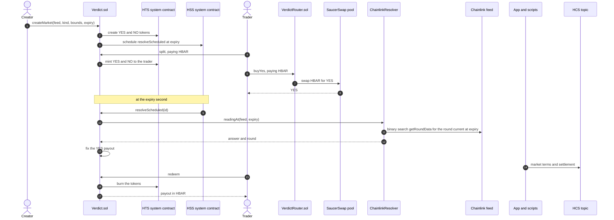

# Verdict

Verdict is a Scaffold-HBAR template for outcome markets on Hedera. A question about a price becomes two HTS tokens, YES and NO, whose payouts always add up to 1 HBAR. A SaucerSwap pool prices the tokens, a Chainlink feed settles them, and the Hedera Schedule Service resolves each market at its expiry with no keeper.

```bash
npm create scaffold-hbar@latest -- --template resistingdestiny/verdict
```


## Quickstart

You need Node 20.18.3 or later. Scaffold, install and start:

```bash
npm create scaffold-hbar@latest -- --template resistingdestiny/verdict
cd verdict
yarn install
yarn next:dev
```

Open http://localhost:3000. The reference deployment on Hedera testnet is committed in `packages/nextjs/contracts/deployedContracts.ts`, so the app shows live markets before you deploy anything. No wallet and no environment variables are needed to browse.

For a non-interactive scaffold:

```bash
npm create scaffold-hbar@latest verdict -- \
  --template resistingdestiny/verdict \
  --frontend nextjs-app \
  --solidity-framework hardhat \
  --network testnet \
  --package-manager npm \
  --skip-hedera-skills \
  --yes
```

The `--` before `--template` matters: without it npm keeps the flag for itself. The project works with Yarn and with npm; the commands below use Yarn, so swap the `yarn` prefix for `npm run` if you scaffolded with npm.

## Deploy your own

Prerequisites:

- Node 20.18.3, pinned in `.nvmrc`
- Yarn through Corepack: `corepack enable`
- A funded Hedera testnet account. Create one at [portal.hedera.com](https://portal.hedera.com); the portal faucet refills to 1,000 HBAR once every 24 hours

Environment variables. The app boots and every page renders with none of these set; they are needed only to deploy and to write the HCS record.

| Variable | File | Required | Purpose |
| --- | --- | --- | --- |
| `DEPLOYER_PRIVATE_KEY` | `packages/hardhat/.env` | One of the two key forms is required to deploy; the hand-run testnet scripts need this plain form | Plain ECDSA private key for scripted deploys |
| `DEPLOYER_PRIVATE_KEY_ENCRYPTED` | `packages/hardhat/.env` | One of the two key forms is required to deploy | Encrypted key written by the account scripts |
| `HEDERA_RPC_URL` | `packages/hardhat/.env` | Optional | JSON-RPC relay override; the public testnet relay is the default |
| `HEDERA_OPERATOR_ID` | `packages/hardhat/.env` and `packages/nextjs/.env.local` | Optional | Account that owns the HCS topic and submits records |
| `HEDERA_OPERATOR_KEY` | `packages/hardhat/.env` and `packages/nextjs/.env.local` | Optional | Key for HCS submissions; without it `/api/record` answers 503 and the rest of the app works |
| `NEXT_PUBLIC_WALLET_CONNECT_PROJECT_ID` | `packages/nextjs/.env.local` | Optional | WalletConnect project id for wallet connections |
| `NEXT_PUBLIC_HEDERA_TESTNET_RPC_URL` | `packages/nextjs/.env.local` | Optional | RPC override for the frontend |
| `NEXT_PUBLIC_HEDERA_MAINNET_RPC_URL` | `packages/nextjs/.env.local` | Optional | RPC override for the frontend |
| `NEXT_PUBLIC_MIRROR_NODE_URL` | `packages/nextjs/.env.local` | Optional | Mirror node override; the public mirror node for the target network is the default |

Copy each `.env.example` to `.env` (or `.env.local` in `packages/nextjs`) and fill in what you need. `.env` files are git-ignored; never commit one.

Deploy:

```bash
yarn hardhat:account:generate
yarn hardhat:test
yarn hardhat:deploy --network hederaTestnet
```

`yarn hardhat:account:generate` writes the encrypted key to `packages/hardhat/.env`; use `yarn hardhat:account:import` to bring an existing key. The deploy script deploys `Verdict`, `ChainlinkResolver` and `VerdictRouter` and writes the addresses to `packages/nextjs/contracts/deployedContracts.ts`. When the operator credentials are set it also creates the HCS record topic and writes the topic id into `packages/nextjs/verdict.config.ts`; without them it skips that step, and you can create the topic later with `yarn record:create-topic`. Verify the contracts so HashScan shows their source:

```bash
yarn hardhat:verify -- Verdict testnet
yarn hardhat:verify -- ChainlinkResolver testnet
yarn hardhat:verify -- VerdictRouter testnet
```

`yarn hardhat:verify-all` verifies all three idempotently from the deployments folder.

Create and seed a first market. The Create page at http://localhost:3000/create walks through it: it shows the live feed price, you pick a kind, bounds and an expiry, it estimates the cost, then it runs create, split, approve and seed in order. From the command line the same steps are three scripts, run from the repo root:

```bash
yarn workspace @sh/hardhat hardhat run scripts/create-market.ts --network hederaTestnet -- \
  --feed HBAR/USD --kind Above --lower 0.10 --expiry 2026-10-09T16:00:00Z

yarn workspace @sh/hardhat hardhat run scripts/seed-pool.ts --network hederaTestnet -- \
  --id 0 --split 20 --liquidity 10

yarn workspace @sh/hardhat hardhat run scripts/trade.ts --network hederaTestnet -- \
  --id 0 --trade buyYes --amount 1
```

`create-market` prints the market id, the YES and NO tokens and the resolution schedule, with HashScan links; use that id for `--id`. Bounds are human units, converted with the feed's decimals. `seed-pool` splits `--split` HBAR, seeds the pool with that many whole YES against `--liquidity` HBAR and pays the pool creation fee. `trade` runs any of the four trades with a 2 percent slippage bound. Two things to know before seeding: `createMarket` charges the two HTS token creation fees plus a resolution reserve and refunds the rest, and seeding the pool leaves the creator holding the NO leg, which is itself a position.

## How it works

A market asks a question about one price feed at one moment. Every market settles on a single number, the YES payout, between 0 and 1 HBAR, and one NO token always pays 1 HBAR minus what one YES token pays.



One market, end to end. A creator asks whether HBAR/USD will be above 0.12 at 16:00 UTC next Friday. `createMarket` creates the YES and NO tokens through the Hedera Token Service, with the contract as treasury and supply key, and schedules its own `resolveScheduled` call for the expiry through the Hedera Schedule Service. Until expiry, anyone can pay 1 HBAR to `split` and receive 1 YES and 1 NO, or hand back one of each to `merge` for 1 HBAR. The creator splits 20 HBAR and seeds a SaucerSwap pool with 20 YES against 10 HBAR, so YES opens at 0.5 HBAR: the market's first odds. Traders buy and sell YES through the router, and the pool price moves with their flow. At the expiry second the scheduled call fires with no account sending it, reads the Chainlink round that was current at that second, and fixes the YES payout. If the feed has no fresh round, nobody can resolve, and 24 hours later anyone can call `voidMarket`, which fixes the payout at 0.5 HBAR. Holders then `redeem`: each YES burns for the payout and each NO for 1 HBAR minus the payout. The market terms and the settlement reading are posted to an HCS topic that anyone can read through the mirror node.

## The four market kinds

All four kinds share one mechanism; only the payoff rule differs. Bounds are stored in the feed's own decimals. The diagrams show what one YES and one NO pay across the price at expiry.

**Above.** YES pays 1 HBAR when the answer is greater than the strike, otherwise nothing.


**Below.** YES pays 1 HBAR when the answer is less than the strike, otherwise nothing.


**Between.** YES pays 1 HBAR when the answer is at or above the lower bound and below the upper bound, otherwise nothing.


**Scalar.** YES pays a share of 1 HBAR that rises in a straight line from nothing at the floor to all of it at the cap: `(answer - floor) / (cap - floor)`, clamped to the range.


## What each Hedera service does here

| Service | Role in Verdict | Where |
| --- | --- | --- |
| Hedera Token Service (HTS) | Creates the YES and NO tokens for every market, mints on split, burns on merge and redeem. The contract is treasury and holds the only supply key; there are no admin, freeze, KYC, wipe, pause or fee keys. | `packages/hardhat/contracts/Verdict.sol` |
| Hedera Schedule Service (HSS) | Each market schedules its own `resolveScheduled` call at creation; the scheduled call fires at the expiry second with no keeper and no account sending it. | `packages/hardhat/contracts/Verdict.sol`, `packages/hardhat/contracts/interfaces/IHederaScheduleService.sol` |
| Hedera Consensus Service (HCS) | One topic is the public record of every market's terms and settlement, written from chain data and readable by anyone. | `packages/nextjs/app/api/record`, `packages/nextjs/app/record`, `packages/hardhat/scripts/record-sync.ts` |
| Mirror node | Serves every read the app cannot get from contract views: odds history from the pool's `Sync` events, association checks, the record feed and the transaction data behind record messages. | `packages/nextjs/lib/mirror.ts`, `packages/nextjs/lib/odds.ts` |

## Why each integration is load-bearing

**SaucerSwap.** The pool is what turns two tokens into an opinion. Without it the contract still splits, merges, settles and redeems, but nothing prices YES against HBAR: there are no odds to show, no quotes to give and no way to enter or exit a position. The market's expectation is a public number anyone can read from the pool reserves, and the four router trades exist only to move that number. Remove SaucerSwap and the app becomes a split and merge kiosk that answers a question nobody can trade on.

**Chainlink.** The resolver decides the one number every market settles on. Without a feed, no market can resolve: each one waits 24 hours past expiry and takes the void path, which fixes the YES payout at 0.5 HBAR whatever the question was, so YES and NO pay identically and the market answers nothing. Chainlink's round history on Hedera testnet is what lets a market settle on the price at its expiry second rather than at whatever moment someone sends a transaction, which is the property that makes the scheduled, keeper-free resolution fair.

## Contract reference

The three interfaces are the contract between the contracts and everything else: `packages/hardhat/contracts/interfaces/IVerdict.sol`, `IResolver.sol` and `IVerdictRouter.sol`. All amounts are tinybars (8 decimals); outcome tokens have 8 decimals, so one unit of YES plus one unit of NO is backed by exactly one tinybar.

### Verdict.sol

| Function | Caller | Behaviour |
| --- | --- | --- |
| `createMarket(resolver, feedId, kind, lower, upper, expiry)` payable | Anyone | Creates YES and NO through HTS, schedules `resolveScheduled` through HSS, takes the token creation fees and the resolution reserve from `msg.value`, refunds the rest |
| `split(id, yesTo, noTo)` payable | Anyone, before expiry | Mints `msg.value` tinybars of YES to `yesTo` and of NO to `noTo` |
| `merge(id, amount, to)` | Anyone, any state | Pulls and burns `amount` of each token from the caller, pays `amount` tinybars to `to` |
| `resolve(id)` | Anyone, at or after expiry | Asks the resolver for the reading at expiry and fixes the YES payout, or reverts with a reason |
| `resolveScheduled(id)` | Anyone; in practice the schedule | Same logic, never reverts, emits `ResolveDeferred` on failure |
| `voidMarket(id)` | Anyone, 24 hours after expiry | Succeeds only when the resolver has no fresh reading; fixes the YES payout at 0.5 HBAR |
| `redeem(id, yesAmount, noAmount, to)` | Anyone, after settlement | Burns the tokens and pays `yesAmount` at the YES payout plus `noAmount` at 1 HBAR minus the payout, rounded down |
| `setResolver(resolver, allowed)` | Owner | Allows or disallows a resolver for new markets; existing markets keep theirs |
| `sweepSurplus(to)` | Owner | Sends HBAR held above tracked collateral and pending reserves |

Views: `marketCount`, `getMarket`, `totalCollateral`, `pendingReserves`, `resolverAllowed`, `creationCost`, `payoutFor`, `MIN_LEAD`, `MAX_LEAD`, `VOID_DELAY`, `RESOLUTION_RESERVE`.

Beyond the frozen interface, the deployed contract adds one owner escape: `setTokenCreateValue(value)` changes the tinybars sent with each HTS token creation (default 1 HBAR, in case the HTS fee schedule changes), with `creationCost()` following it immediately.

Events: `MarketCreated`, `ScheduleFailed`, `Split`, `Merged`, `Resolved`, `ResolveDeferred`, `Voided`, `Redeemed`, `ResolverSet`, `SurplusSwept`.

Errors: `HtsError`, `HssError`, `NotAssociated`, `NoSuchMarket`, `ResolverNotAllowed`, `ExpiryTooSoon`, `ExpiryTooFar`, `InvalidBounds`, `InsufficientValue`, `ZeroAmount`, `AmountTooLarge`, `MarketNotOpen`, `MarketNotExpired`, `MarketNotSettled`, `NoFreshReading`, `FreshReadingExists`, `VoidTooEarly`, `NothingToSweep`, `TransferFailed`.

### ChainlinkResolver.sol

Implements `IResolver`: `readingAt(feedId, time)` reads `latestRoundData` and, when that round is newer than `time`, binary searches the aggregator's current phase with `getRoundData` for the greatest round published at or before `time`, capped at `MAX_READS` 40 reads with every aggregator read wrapped in `try`, so a failing read becomes "no fresh reading" rather than a revert, and the reading stays reachable however many rounds are published after expiry. It returns `ok` false for a non-positive answer or a round older than the feed's maximum staleness. Feeds are allowlisted at deployment, each with its own staleness limit. `describe` returns a human-readable feed name and `feedDecimals` the feed's decimals. The reference deployment allowlists HBAR / USD, BTC / USD and ETH / USD on Hedera testnet, all 8 decimals with round history confirmed through `getRoundData`. Their addresses and staleness limits (6 hours for HBAR / USD, 24 hours for BTC / USD and ETH / USD, set from the observed update cadence) live in `packages/hardhat/config/addresses.ts`.

### VerdictRouter.sol

One transaction per trade against a market's SaucerSwap pool. Stateless and replaceable: it ends every transaction holding no HBAR and no outcome tokens, and a test asserts that after each trade.

| Function | You send | You receive |
| --- | --- | --- |
| `buyYes(id, minYesOut, deadline)` payable | HBAR | YES from the pool |
| `sellYes(id, yesIn, minHbarOut, deadline)` | YES | HBAR from the pool |
| `buyNo(id, minHbarBack, deadline)` payable | HBAR | NO equal to the HBAR sent, plus the proceeds of selling the YES leg |
| `sellNo(id, noIn, minHbarOut, deadline)` payable | NO, plus enough HBAR to buy the matching YES | `noIn` HBAR from merging the pairs, plus the HBAR not spent |

Views: `pairOf`, `reserves`, `impliedProbability` and a quote per trade (`quoteBuyYes`, `quoteSellYes`, `quoteBuyNo`, `quoteSellNo`), each net of pool fees. Every trade takes a slippage bound and a deadline, and SaucerSwap refunds are forwarded to the caller in the same transaction. Events: `Traded`. Errors: `Expired`, `Slippage`, `NoPool`, `NoSuchMarket`, `ZeroAmount`, `InsufficientValue`, `RouterNotEmpty`, `HtsError`, `TransferFailed`.

### Invariants

1. The contract balance is at least `totalCollateral` plus pending reserves, always.
2. While a market is open, its collateral equals the supply of YES and the supply of NO.
3. After settlement, `collateral * 1e8 >= yesSupply * payout + noSupply * (1e8 - payout)`.
4. A payout is written once and no function can change it.
5. State is updated before any external call, and every function that pays HBAR is guarded against reentrancy.
6. `Verdict.sol` makes no call to a DEX and grants no allowance to one.

## Costs

Planning estimate before measurement: about 60 HBAR per market in fees before liquidity, mostly the two HTS token creations and the SaucerSwap pool creation fee. The measured HBAR and gas for every step, recorded on Hedera testnet, are in [docs/COSTS.md](docs/COSTS.md).

## Troubleshooting

Problems hit during this build, with what caused them and what to do. If you hit a new one and learn why, add a row.

| What you see | Why | What to do |
| --- | --- | --- |
| `yarn hardhat:deploy` does not reach the node on port 8545 | Without `--network localhost` Hardhat uses the in-process network, not the running node | Pass `--network localhost` while `yarn hardhat:chain` runs |
| Deploy or verify fails with "Sender account not found" | The deployer account has no HBAR on the target network | Fund it at [portal.hedera.com](https://portal.hedera.com/faucet) |
| `hardhat-verify` fails against Sourcify | The Sourcify API v1 that Hardhat 2 plugins speak was removed | Use `yarn hardhat:verify`, which submits to the Sourcify API v2 |
| Scheduled calls never fire in local tests | The Hedera forking plugin emulates HTS but not HSS | The test suite installs mocks at `0x167` and `0x16b` with `hardhat_setCode` and executes schedules by hand; see `packages/hardhat/test/helpers/hedera.ts` |
| `split`, a router trade or a token transfer fails with `NotAssociated(token)` (HTS code 184 or 262) | The recipient is not associated with the outcome token and has no free automatic association slot; the facade's `balanceOf` returns 0 for an unassociated account, so a balance read cannot tell you this | Associate first: the app offers a one-click associate through the token facade's `associate()` (HIP-719) before any action that sends tokens, and a wallet can set automatic association slots. On the local mocks, `MockHederaTokenService.setAutoAssociationSlots(account, MaxUint256)` does what a wallet setting does |
| `getRoundData` returns nothing for old rounds on some oracle deployments | Not every aggregator keeps history | The resolver reports `ok` false when a read inside its search fails; check that `getRoundData` returns history before choosing a feed |
| `useScaffoldEventHistory.ts: Argument of type '{}' is not assignable to parameter of type 'string \| number \| bigint \| boolean'` | The hook assumed every entry in `deployedContracts.ts` has `deployedOnBlock`; the stand-in entries do not. | Fixed in the hook: a missing `deployedOnBlock` reads as block 0. |
| `Type 'string' is not assignable to parameter of type '0x${string}'` when passing an address to a viem helper | `types/abitype/abi.d.ts` registers `AddressType` as `string`, so viem's `Address` is a plain string in this scaffold. | Cast to `` `0x${string}` `` at the call site, as `lib/feeds.ts` does for `pad`. |
| HashScan answers 404 for a transaction link from a toast | The scaffold built `/tx/<hash>`; HashScan serves `/transaction/<hash>`. | Fixed in `utils/scaffold-hbar/networks.ts`. |
| The odds history is empty although the pool has traded | `eth_getLogs` on the public relay is capped to a short block range. | The app reads `Sync` logs from the mirror node instead (`lib/odds.ts`, `fetchSyncHistory`). Set `NEXT_PUBLIC_MIRROR_NODE_URL` to use another mirror node. |
| `Transaction reverted` with no decoded reason on a SaucerSwap call | The SaucerSwap ABIs in `externalContracts.ts` carry no custom errors, so the scaffold cannot name the revert. | Check the transaction on HashScan; the usual causes are a missing YES allowance for the router, too little value for the pool creation fee, or no free automatic association slot for the LP token. |
| `yarn next:check-types` takes several minutes | The shared workstation is loaded and the Next type check covers the whole package. | Run it in the background and keep working; it is not a repo problem. |
| `TypeError: The "mcopy" instruction is only available for Cancun-compatible VMs` when compiling anything that imports `@openzeppelin/contracts/utils/Strings.sol` | OpenZeppelin 5.6 `Strings` pulls in `Bytes.sol`, which uses `mcopy`; the scaffold compiles for the paris EVM target because Hedera does not support Cancun opcodes | Do not import `Strings`. `Verdict.sol` renders token names with its own 10-line `_decimal` helper. `Ownable` and `ReentrancyGuard` are unaffected |
| `yarn hardhat:test` is slow to start and prints a block number in the tens of millions | `networks.hardhat.forking.url` was set in `hardhat.config.ts`, so the in-process network forked Hedera testnet through hashio on every run even though the tests only use the mocks at `0x167` and `0x16b` | Fixed in `hardhat.config.ts`: forking is enabled only when `HEDERA_FORKING=true` (`yarn hardhat:fork`), so the local node and the tests are hermetic |
| `yarn hardhat:test some/path.test.ts` says `Cannot find module .../packages/hardhat/packages/hardhat/...` | The root script runs inside `packages/hardhat`, so test paths are relative to that package | `yarn hardhat:test test/Verdict.test.ts` |
| `HtsError(292)` or `HtsError(293)` from `merge` or `redeem` | Verdict pulls tokens through an HTS allowance; 292 is no allowance, 293 is an allowance smaller than the amount | Approve Verdict on both YES and NO for at least the amount, through the token's ERC-20 `approve` or HTS `approve` |
| `ExpiryTooSoon(expiry, earliest)` with `earliest` one second later than expected | The lead is measured from the block the creation transaction lands in, which is one second after the latest block on Hardhat | Add a margin to the expiry when scripting |
| `ScheduleFailed(id, code)` in the creation receipt and `schedule` is `address(0)` | HSS refused the schedule (code 306 too far, 370 every probed second busy, or a forced test code). The market is still valid | Anyone can call `resolve(id)` at or after expiry. Nothing else changes |
| `yarn hardhat:compile` fails but a chained `git commit` still runs | Piping through `tail` or `grep` returns the exit code of the last command in the pipe, not of the compiler | Run the compile on its own and check its output, or use `set -o pipefail` |
| `TypeError: Explicit type conversion not allowed from non-payable "address" to "contract X", which has a payable fallback function` | The target contract declares `receive() external payable`, so Solidity requires a payable cast | Convert with `X(payable(addr))`, or drop the `receive` when nothing sends the contract bare HBAR |
| `Function cannot be declared as view` when calling `tinycentsToTinybars` on `0x168` | The exchange rate system contract refreshes its rate on every call, so the function is not `view` | Treat it as state-changing: no `view` on any helper that calls it, and use `staticCall` from TypeScript to read it |
| Mocha times out in a `before each` hook on the build box, usually while another heavy job runs | The box is shared and loaded (load average passed 100 during the build); mock-heavy fixtures exceed mocha's 2s default | The hardhat config sets a 600s mocha timeout. Deploy the fixture once and revert to a snapshot per test, and do not run `check-types` and the test suite in parallel |
| `agent-trade.ts` or `record-sync.ts` fails with `Unexpected token '<', "<!doctype "... is not valid JSON` | The script fetched an HTML error page because nothing was serving the API at `VERDICT_APP_URL` (default `http://localhost:3000`) | Start the app with `yarn next:start`, or point `VERDICT_APP_URL` at a running instance. The scripts now report "did not return JSON" instead |
| `/api/record` answers 503 `HCS operator not configured` | `HEDERA_OPERATOR_ID` and `HEDERA_OPERATOR_KEY` are not set in the server environment; the route cannot submit to the topic without them | Add both to `packages/nextjs/.env.local`. The rest of the app works without them |
| `/api/record` answers 503 `HCS topic not configured` | `hcsTopicId` in `packages/nextjs/verdict.config.ts` is still null | Run `yarn record:create-topic` with the operator env set; it writes the topic id into the config |
| `yarn hardhat:compile` fails but a chained `git commit` still runs. | Piping through `tail` or `grep` returns the exit code of the last command in the pipe, not of the compiler. | Run the compile on its own and check its output, or use `set -o pipefail`. |
| `TypeError: Explicit type conversion not allowed from non-payable "address" to "contract X", which has a payable fallback function`. | The target contract declares `receive() external payable`, so Solidity requires a payable cast. | Convert with `X(payable(addr))`, or drop the `receive` when nothing sends the contract bare HBAR. |
| `Function cannot be declared as view` when calling `tinycentsToTinybars` on 0x168. | The exchange rate system contract refreshes its rate on every call, so the function is not `view`. | Treat it as state-changing: no `view` on any helper that calls it, and use `staticCall` from TypeScript to read it. |
| `agent-trade.ts` or `record-sync.ts` fails with `Unexpected token '<', "<!doctype "... is not valid JSON` | The script fetched an HTML error page because nothing was serving the API at `VERDICT_APP_URL` (default `http://localhost:3000`). | Start the app with `yarn next:start`, or point `VERDICT_APP_URL` at a running instance. The scripts now report "did not return JSON" instead. |
| `/api/record` answers 503 `HCS operator not configured` | `HEDERA_OPERATOR_ID` and `HEDERA_OPERATOR_KEY` are not set in the server environment; the route cannot submit to the topic without them. | Add both to `packages/nextjs/.env.local`. The rest of the app works without them. |
| `/api/record` answers 503 `HCS topic not configured` | `hcsTopicId` in `packages/nextjs/verdict.config.ts` is still null. | Run `yarn record:create-topic` with the operator env set; it writes the topic id into the config. |
| `This script runs on Hedera testnet only. Add --network hederaTestnet` from `e2e-testnet.ts` or `reference-deployment.ts` | The script was started with `hardhat run` without the network flag, so it targeted the in-process Hardhat network. | Use `yarn hardhat:e2e-testnet` or `yarn hardhat:reference-deployment`, which pass `--network hederaTestnet`. |
| `The deployer is Hardhat's default account. Set DEPLOYER_PRIVATE_KEY` | `hardhat.config.ts` falls back to the well-known Hardhat key when `.env` has no plain `DEPLOYER_PRIVATE_KEY`; the encrypted key that `yarn deploy` decrypts is not available to `hardhat run`. | Put the plain `0x` key in `packages/hardhat/.env` as `DEPLOYER_PRIVATE_KEY` for the testnet scripts. Never commit `.env`. |
| `.testnet-run.json belongs to 0x... on hederaTestnet, not ...` | The checkpoint from an earlier run was made by another deployer account. | Move `packages/hardhat/.testnet-run.json` aside to start a fresh run. Completed paid steps for the old account stay in the old file. |
| `[wait] <step>: mirror lookup pending` repeats and the summary shows `cost pending` | The mirror node had not indexed the transaction within 45 seconds, or `HEDERA_MIRROR_URL` points somewhere unreachable. | Rerun the script: every paid step is skipped and the flush retries the lookups. The final flush writes the row with the hash alone so no step is lost. |
| `e2e-testnet` reports `The schedule did not fire within 20 minutes of expiry` and resolves by hand | The HSS schedule for the market did not execute (capacity, an expiry second that was never reached, or a `ScheduleFailed` at creation). | The run already called `resolve(id)`; the evidence row says `manual resolve fallback`. Check the schedule entity on HashScan and record the finding in `docs/DECISIONS.md` under spike findings. |
| `reference-deployment` exits with code 2 and `STOP: the deployer balance fell below 150 HBAR` | The brief's floor: no new market is created once the deployer holds less than 150 HBAR. | Fund the deployer and rerun; markets already created are skipped from the checkpoint. |
| `verify-all` says `No artifacts/build-info` | Sourcify needs the exact compiler input, which only a compile in this checkout produces. | Run `yarn hardhat:compile` first, then `yarn hardhat:verify-all`. |
| A test in `Verdict.test.ts` fails with `expected 4 to equal 2` on `hts.tokenCount()` when the whole suite runs, but passes alone. | `loadFixture` from hardhat-network-helpers runs a fixture it has not seen before on top of the current chain state, so a file that ran earlier and left HTS mock tokens behind leaks them into the next file's fixture. | Test files that deploy their own fixture take an `evm_snapshot` before deploying and revert to it in `after`, as `Integration.test.ts` and `Coverage.test.ts` do. |
| `yarn hardhat:coverage` reports a branch in `VerdictRouter.reserves` as uncovered. | The `token0() == yes` arm needs a pair whose YES token has a lower address than WHBAR, which cannot happen on Hedera or in the mock pair. | Expected; the reason is recorded under Coverage in `docs/SECURITY.md`. |
| Slither in CI fails on a `reentrancy-eth` or `unused-return` finding after a contract edit. | The inline `slither-disable-next-line` comment must sit on the line directly above the statement Slither reports, and the suppressed detector must be named. | Re-run `slither packages/hardhat --config-file slither.config.json`, move or add the comment, and add the one-line reason to `docs/SECURITY.md`. |
| Every route logs `Failed to load resource: 400` from `testnet.hashio.io` and the console shows `eth_call` to `0x0000000000000000000000000000000000000000`. | `useDeployedContractInfo` treated the zero-address placeholder in `deployedContracts.ts` as deployed: viem's `getCode` returns `undefined` for an empty `0x` answer and the hook only compared against the string `"0x"`, so reads fired against address zero and the relay rejected them. | Fixed in `hooks/scaffold-hbar/useDeployedContractInfo.ts` (`!code || code === "0x"`). The Playwright run records the URL and status of every failed request next to the console errors, so the next such case names itself. |

## Extending

- **New market kind.** One enum value, one payoff branch, one test table, one label, one diagram. The full walkthrough that adds an Outside kind is [docs/TUTORIAL.md](docs/TUTORIAL.md).
- **Other oracles.** Implement `IResolver` (`readingAt`, `describe`, `feedDecimals`), deploy it, and have the owner allow it with `setResolver`. `resolvers/ChainlinkResolver.sol` is the reference; a guarded resolver that cross-checks a second oracle is sketched in [docs/ARCHITECTURE.md](docs/ARCHITECTURE.md).
- **Other collateral.** Out of scope for this template. The split, merge and redeem path assumes HBAR in tinybars, so changing the collateral means reworking the collateral accounting in `Verdict.sol`.
- **Other venues.** SaucerSwap V2 pools suit outcome tokens because their price is bounded between 0 and 1 HBAR. The core and router boundary means a new venue touches only `VerdictRouter.sol`; collateral code never changes. Limit orders, protocol fees and governance are further extensions in the same layer.
- **Test an extension with Hedera Harness.** The `.harness/` recipe has a fresh agent add the Outside kind and grades the result; it is the automated form of the AGENTS.md test. With [hedera-harness](https://github.com/hedera-dev/hedera-harness) installed as a dev dependency, run `npx hedera-harness doctor` to check the setup, `npx hedera-harness validate` for the deterministic checks without an agent, and `npx hedera-harness run` for the full run.

## Limits and risks

- Unaudited and testnet only. Do not deploy to mainnet.
- Liquidity providers lose value as a market nears settlement: the pool holds YES against HBAR, and the YES side converges to its settlement value.
- The outcome depends on the resolver. A stale feed blocks resolution and sends the market to the void path, which pays both sides 0.5 HBAR regardless of the question.
- Seeding a pool is a position. The creator ends up holding the NO leg plus the pool's LP token.
- The owner can only sweep HBAR above tracked collateral and pending reserves, and allow or disallow resolvers for new markets. No address can change a payout or move collateral.

## Evidence, licence and credits

[docs/EVIDENCE.md](docs/EVIDENCE.md) holds a HashScan link for every step of the market lifecycle on the reference deployment: deployments, a market creation with both token creations, the schedule entity, a split, the pool creation, all four trades, the scheduled resolution showing that no account sent it, redemptions, the HCS record, and the contract balance across the scheduled run.

Verdict is MIT licensed; see [LICENSE](LICENSE). It is built on the [Scaffold-HBAR](https://docs.hedera.com/solutions/tools/scaffold-hbar) blank template by Hedera, scaffolded with [create-scaffold-hbar](https://github.com/hedera-dev/create-scaffold-hbar). Pool creation and swaps use [SaucerSwap V1](https://docs.saucerswap.finance/developers/v1/liquidity/create-a-new-pool) on Hedera testnet. Settlement reads [Chainlink price feeds](https://github.com/ed-marquez/hedera-example-chainlink-price-feeds) on Hedera testnet. Scheduling follows [HIP-1215](https://hips.hedera.com/hip/hip-1215) and the [HSS system contract docs](https://docs.hedera.com/evm/hedera-services/system-contracts/schedule-service).
