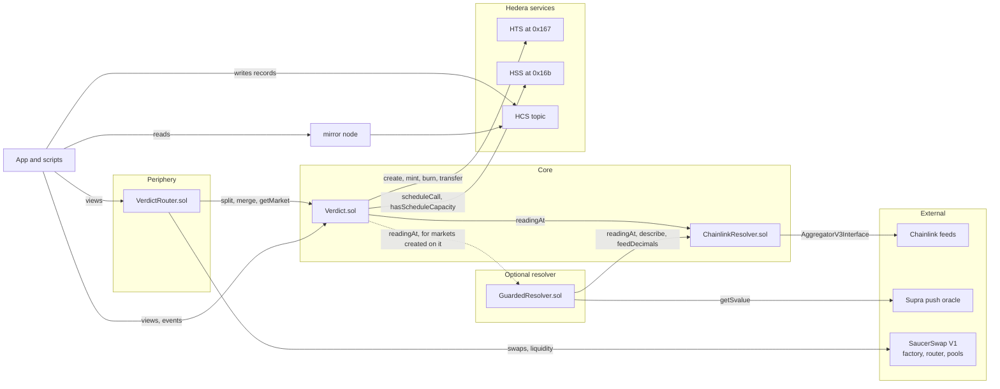
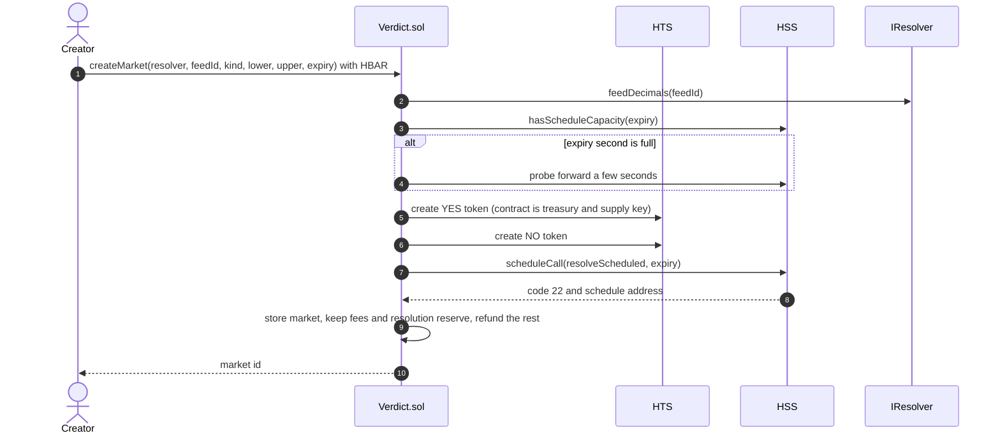
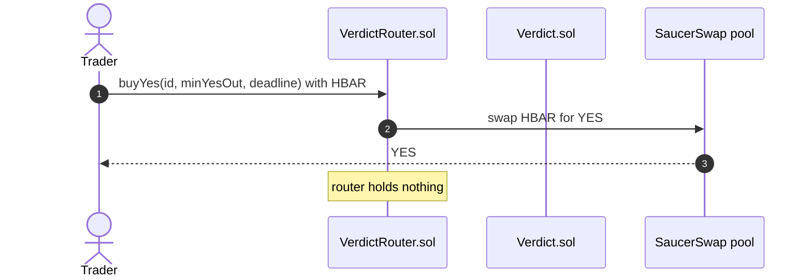
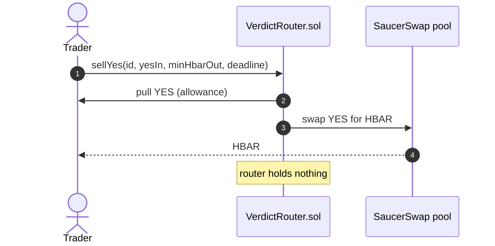
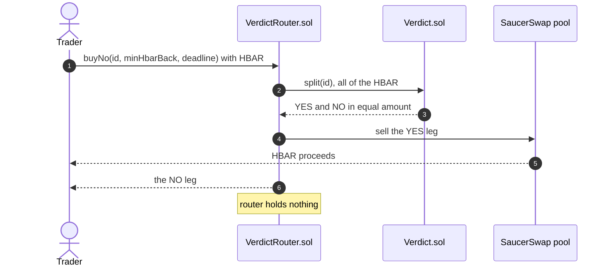
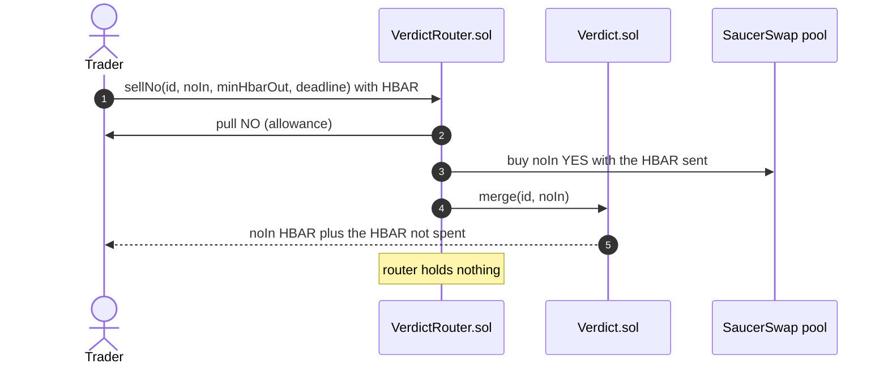
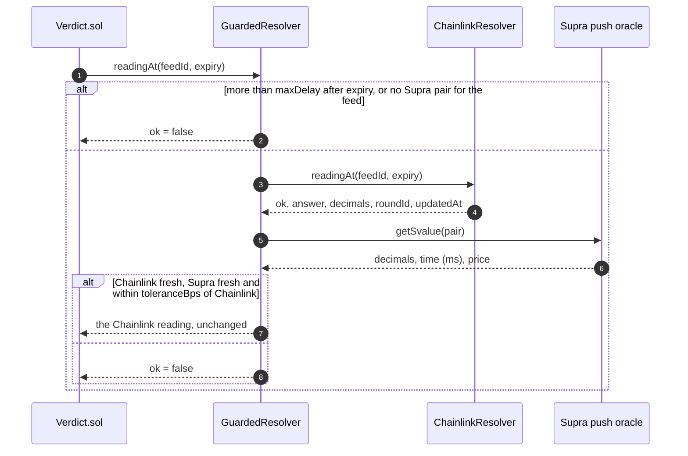

# Architecture

How Verdict is put together: the contracts, the calls between them, and the flows for creating a market, trading, and scheduled resolution. The interfaces in `packages/hardhat/contracts/interfaces/` are the ground truth and this document explains them. They are frozen, except that new `Kind` values may be appended, which is how a market kind is added.

A few Hedera terms first. Hedera exposes its native services to Solidity as system contracts at fixed addresses. The Hedera Token Service (HTS, at `0x167`) creates and manages tokens without a token contract. The Hedera Schedule Service (HSS, at `0x16b`) runs a call at a future time on the network's own initiative. The Hedera Consensus Service (HCS) is a public append-only message log made of topics. The mirror node is Hedera's public REST API for history: past transactions, contract logs, token holdings and topic messages.

## The contracts and their calls



| Contract | Tier | Role | Calls |
| --- | --- | --- | --- |
| `Verdict.sol` | Core | Markets, outcome tokens, collateral, settlement, redemption | HTS, HSS, a resolver |
| `resolvers/ChainlinkResolver.sol` | Core | Finds the feed round current at a given time and checks its freshness | Chainlink |
| `resolvers/GuardedResolver.sol` | Optional resolver | Passes on the ChainlinkResolver reading only when the Supra push oracle agrees with it | ChainlinkResolver, Supra |
| `VerdictRouter.sol` | Periphery | Four trades in one transaction each, quotes and pool lookup. Holds nothing between transactions | Verdict, SaucerSwap |

## The core and router boundary

This boundary is the main design decision. Collateral (the HBAR that backs every YES and NO pair) lives in `Verdict.sol`, which never calls a decentralised exchange (DEX) and never approves one to spend its tokens. Everything that touches SaucerSwap sits outside it and uses only its public functions, so a fault in trading code cannot reach collateral.

Three things follow from it:

- **The router can be replaced.** The router is stateless and holds nothing between transactions. A new router (for a new venue or a better quoting rule) can be deployed and pointed at the same markets without touching user funds. The worst a bad router can do is fail its own transaction.
- **Less code holds value.** The contract that holds value depends on nothing outside itself except the Hedera system contracts and the resolver view. Pool math, slippage and deadlines live in the layer that holds nothing.
- **Invariant 6 is testable.** A test can assert that no call path out of `Verdict.sol` reaches a DEX address and that it grants no allowances, and the property tests check the collateral invariants after every random action.

The same reasoning applies to anything added later: if it uses only public functions and has no special rights, it cannot harm the core. `GuardedResolver`, described near the end, is one such addition, and the series sketched after it would be another.

## Create



The contract is each token's treasury (the account that holds new supply) and its only supply key (the key allowed to mint and burn). HSS can run only a limited number of scheduled calls in any one second, so `createMarket` asks `hasScheduleCapacity` first and moves to the next second when one is full.

If scheduling returns anything but code 22 (success) and a non-zero address, the market is still created. `ScheduleFailed` is emitted, and the market relies on manual `resolve` calls after expiry. The expiry must be at least `MIN_LEAD` seconds ahead and at most `MAX_LEAD`, the HSS scheduling horizon.

## Trade

All four trades go through `VerdictRouter.sol` and end with the router holding nothing. `buyYes` and `sellYes` are plain pool swaps. `buyNo` and `sellNo` combine a swap with a split or a merge, so NO can be traded even though only YES has a pool.









The market creator's account creates and seeds the pool through SaucerSwap, either from the Create page or with the seed script. It calls `addLiquidityETHNewPool` with the HBAR liquidity plus the factory's `pairCreateFee`. Seeding at an even price, for example 20 YES against 10 HBAR after splitting 20 HBAR, leaves the creator holding the NO leg.

## Scheduled resolution

```mermaid
sequenceDiagram
    autonumber
    participant HSS as HSS
    participant V as Verdict.sol
    participant R as ChainlinkResolver
    participant CL as Chainlink feed
    Note over HSS,V: at the expiry second, no account sends this
    HSS->>V: resolveScheduled(id)
    V->>R: readingAt(feedId, expiry)
    R->>CL: latestRoundData, then a getRoundData binary search (cap 40 reads)
    CL-->>R: the round current at expiry
    alt fresh round found
        R-->>V: ok, answer, roundId, updatedAt
        V->>V: fix the YES payout once, emit Resolved(bySchedule = true)
    else no fresh round
        R-->>V: ok = false
        V->>V: emit ResolveDeferred(reason)
        Note over V: anyone may call resolve(id) later;<br/>24 hours after expiry voidMarket(id)<br/>fixes the payout at 0.5 HBAR
    end
```

`resolveScheduled` never reverts. A reverting scheduled call would waste the resolution reserve and still leave the market unsettled.

The settlement rule is strict. The market settles on the feed round that was current at the expiry second, and a round older than the expiry minus the feed's maximum staleness does not count.

The scheduling contract pays for the scheduled call. That is why each market is charged a resolution reserve at creation, tracked in `pendingReserves` and released at settlement.

Inside the scheduled call, `block.timestamp` can trail consensus time by a second or two. `_settle` therefore trusts the schedule's timing when the caller is Verdict itself, which only the network's execution of a schedule can arrange. "Scheduled run timing" in [SECURITY.md](SECURITY.md) has the full story.

## Units and the relay

Contracts see HBAR as tinybars, with 8 decimals: 1 HBAR is 100,000,000 tinybars, and every amount in the contracts and their events is in tinybars. Wallets and the JSON-RPC relay (the service that lets Ethereum tools talk to Hedera) use weibars, with 18 decimals, so 1 tinybar is 10,000,000,000 weibars. The app converts in one place, `packages/nextjs/lib/format.ts`, at the moment a wallet is asked to sign. Contract arguments stay in tinybars.

## Where everything else lives

- **The HCS record.** `/api/record` builds each message from the transaction's Verdict events, read through the mirror node, never from the request body. It writes each message once. `packages/hardhat/scripts/record-sync.ts` does the same from the command line. There are two message types, `market_created` and `market_settled`; a void is recorded as a settlement at the 0.5 HBAR payout. The shapes and builders live in `packages/nextjs/app/api/_lib/messages.ts`.
- **Reads.** The frontend reads contract views and events only. The mirror node covers what views cannot: the record feed, and the odds history from the pool's `Sync` events. Association and odds lookups go through server routes under `/api/mirror/*`.
- **Addresses.** External addresses come from `packages/hardhat/config/addresses.ts`, the only file with hard-coded addresses. Each entry has its source URL and the date it was checked. The frontend learns the deployed contract addresses from `packages/nextjs/contracts/deployedContracts.ts`, which the deploy script rewrites.

## A second oracle: GuardedResolver

`resolvers/GuardedResolver.sol` implements `IResolver` over two sources: the deployed `ChainlinkResolver` and the Supra push oracle. Verdict needs no change to use it. The owner allows it with `setResolver`, and a market created against it settles through it. The answer it returns is always Chainlink's; Supra only decides whether the answer is passed on.



Configuration is fixed at deployment and the contract has no owner: the two addresses, the tolerance in basis points, `maxDelay`, `supraMaxStaleness`, and a Supra pair index per Chainlink feed id. Both prices are brought to the same decimals before the comparison `|chainlink - supra| * 10_000 <= toleranceBps * chainlink`. `describe` and `feedDecimals` delegate to `ChainlinkResolver`, and revert for a feed with no Supra pair, so no market can be created on a feed the guard would never pass.

Supra keeps only its latest value, so the guard can be checked only close to expiry. Every reading requested more than `maxDelay` seconds after its time is refused. The scheduled settlement, one second after expiry, falls well inside that window. A market whose check fails, or that nobody resolves within the window, keeps reporting no fresh reading, and `voidMarket` releases it 24 hours after expiry through the existing void path. The deploy defaults (150 basis points, 10 minutes, 3 hours) and the Supra address and pairs live in `packages/hardhat/config/addresses.ts`. The Supra pairs are quoted against USDT and the Chainlink feeds against USD, which is why the tolerance is not tighter.

## Designed but not built

One stretch contract was designed and not built. It does not exist in the repo. It is described here because it follows the core and router boundary and makes a natural extension.

- **A self-running series** would run a line of markets with nobody at the keyboard, for example a daily HBAR/USD Above market struck at the last settlement price. Each roll would be a chain of three scheduled calls, because one call would be too heavy: close (resolve the expiring market, remove the old pool's liquidity, redeem), open (create the next market and schedule the next roll) and seed (split from a reserve, create the pool, add liquidity). No step would revert; each would emit an event, and a `poke()` would let anyone run a stalled step. The series would stop after a set number of rolls (`maxRolls`) or when its reserve could not cover the measured cost of a roll, saying why in an event, and its owner could pause it and withdraw the reserve. A contract cannot hold a pool's LP token (the token that records a share of the pool) until it is associated with it, and that token does not exist until the pool does, so the series would associate in the seed step once the pool address is known.
