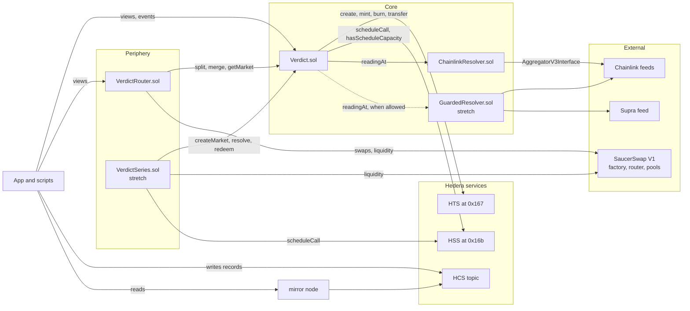
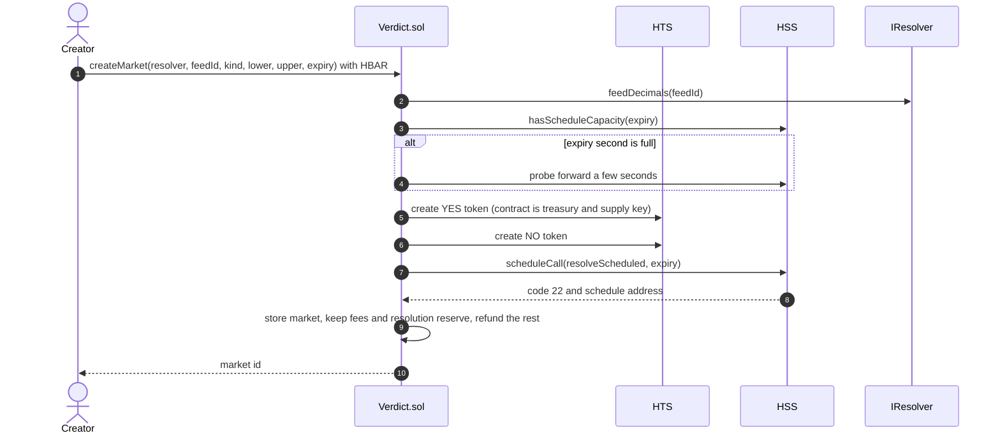
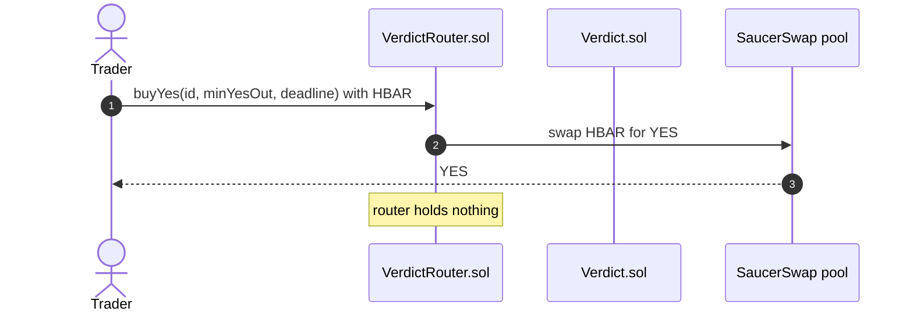
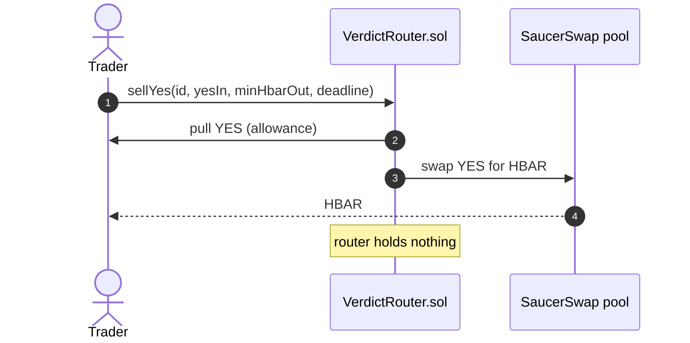
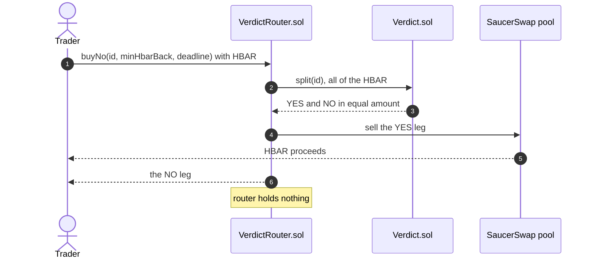
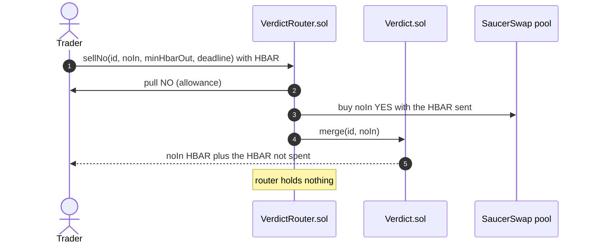
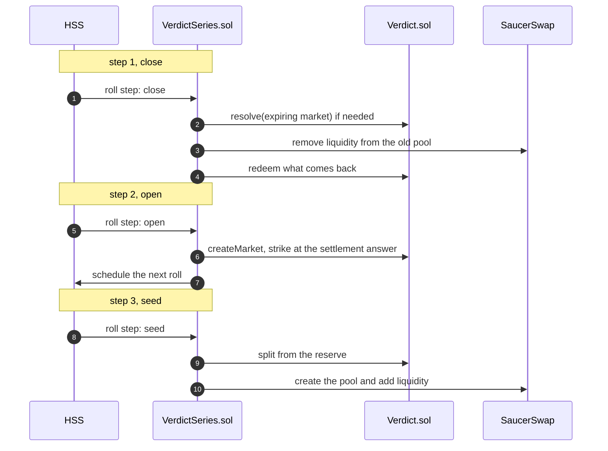

# Architecture

How Verdict is put together: the contracts, the calls between them, and the flows for create, trade, scheduled resolution and the series roll. The interfaces in `packages/hardhat/contracts/interfaces/` are frozen and are the ground truth; this document explains them.

## The contracts and their calls



| Contract | Tier | Role | Calls |
| --- | --- | --- | --- |
| `Verdict.sol` | Core | Markets, outcome tokens, collateral, settlement, redemption | HTS, HSS, a resolver |
| `resolvers/ChainlinkResolver.sol` | Core | Finds the feed round current at a given time and checks its freshness | Chainlink |
| `VerdictRouter.sol` | Core | Four trades in one transaction each, quotes and pool lookup. Holds nothing between transactions | Verdict, SaucerSwap |
| `VerdictSeries.sol` | Stretch | A series that resolves, renews and seeds its own markets | Verdict, SaucerSwap, HSS |
| `resolvers/GuardedResolver.sol` | Stretch | Accepts a Chainlink reading only when a Supra reading agrees | Chainlink, Supra |

## The core and router boundary

The boundary is the design. Collateral lives in `Verdict.sol`, which never calls a DEX and never approves one. Everything that touches SaucerSwap sits outside it and uses only its public functions, so a fault in trading code cannot reach collateral.

Three consequences:

- **Replaceability.** The router is stateless and holds nothing between transactions, so a new router (a new venue, a better quoting rule) can be deployed and pointed at the same markets without touching user funds. The worst a bad router can do is fail its own transaction.
- **A smaller audit surface.** The contract that holds value has no external dependency except the Hedera system contracts and the resolver view. Pool math, slippage and deadlines live in the layer that holds nothing.
- **Invariant 6 is testable.** A test can assert that no call path out of `Verdict.sol` reaches a DEX address and that it grants no allowances, and the property tests check the collateral invariants after every random action.

The same reasoning puts the series and the guarded resolver outside the core: both use only public functions and have no special rights, so neither can harm the core, and both ship only once proven on Hedera testnet.

## Create



If scheduling returns anything but code 22 and a non-zero address, the market is still created, `ScheduleFailed` is emitted and the market relies on manual `resolve` calls after expiry. The expiry must be at least `MIN_LEAD` seconds ahead and at most `MAX_LEAD`, the HSS scheduling horizon.

## Trade

All four trades go through `VerdictRouter.sol` and end with the router holding nothing. `buyYes` and `sellYes` are plain pool swaps; `buyNo` and `sellNo` combine a swap with split or merge so that NO is tradable even though only YES has a pool.









The pool itself is created and seeded by the market creator's account through SaucerSwap (`addLiquidityETHNewPool`, with the HBAR liquidity plus `pairCreateFee` from the factory), from the Create page and from the seed script. Seeding at an even price, for example 20 YES against 10 HBAR after splitting 20 HBAR, leaves the creator holding the NO leg.

## Scheduled resolution

```mermaid
sequenceDiagram
    autonumber
    participant HSS as HSS
    participant V as Verdict.sol
    participant R as ChainlinkResolver
    participant CL as Chainlink feed
    Note over HSS,V: at the expiry second, no account sends this
    HSS->>V: resolveScheduled(id)
    V->>R: readingAt(feedId, expiry)
    R->>CL: latestRoundData, then getRoundData walking back (cap 32)
    CL-->>R: the round current at expiry
    alt fresh round found
        R-->>V: ok, answer, roundId, updatedAt
        V->>V: fix the YES payout once, emit Resolved(bySchedule = true)
    else no fresh round
        R-->>V: ok = false
        V->>V: emit ResolveDeferred(reason)
        Note over V: anyone may call resolve(id) later;<br/>24 hours after expiry voidMarket(id)<br/>fixes the payout at 0.5 HBAR
    end
```

`resolveScheduled` never reverts, because a reverting scheduled call would waste the resolution reserve and still leave the market unsettled. The settlement rule is strict: the market settles on the feed round that was current at the expiry second, and a round older than the expiry minus the feed's maximum staleness does not count. The scheduling contract is the payer for the scheduled call, which is why each market is charged a resolution reserve at creation, tracked in `pendingReserves` and released at settlement.

## Series roll (stretch)

`VerdictSeries.sol` runs a line of markets with nobody at the keyboard. The reference series is a daily HBAR/USD Above market struck at the last settlement price. Each roll is a chain of scheduled calls, because one call would be too heavy.



No scheduled step ever reverts; each emits an event, and `poke()` lets anyone run a stalled step. The series stops after `maxRolls`, or when its reserve cannot cover the measured cost of a roll, and says why in an event. The owner can pause it and withdraw the reserve. A contract cannot hold a pool's LP token until it is associated with it, and that token does not exist until the pool does, so the series associates in the seed step once the pool address is known.

## Where everything else lives

- The HCS record: `/api/record` builds each message from the transaction's Verdict events read through the mirror node, never from the request body, and writes each message once. `scripts/record-sync.ts` does the same from the command line. The message shapes are in the README under How it works and in `docs/EVIDENCE.md`.
- The frontend reads contract views and events only; the mirror node covers what views cannot (the record feed, odds history from pool `Sync` events). External addresses come from `packages/hardhat/config/addresses.ts`, the only file with hard-coded addresses, each entry with its source URL and the date checked.
