# Walkthrough

This page follows one session in the app from start to finish, with a screenshot for each step. Everything shown is real: the app was talking to Hedera testnet, and every transaction was signed by the app's built-in burner wallet (funded on testnet) and confirmed on the ledger. You can repeat it yourself after the [Quickstart](../README.md#quickstart), or against your own deployment after [Deploy your own](../README.md#deploy-your-own).

A few words used below:

- **YES and NO** are the two tokens every market issues on the Hedera Token Service (HTS). One YES plus one NO is always worth exactly 1 HBAR.
- **Odds** are the price of YES in its SaucerSwap pool. A YES priced at 0.52 HBAR means the market expects a 52 percent chance.
- **Association** is a Hedera rule: an account must be associated with a token before it can hold it. The app shows an Associate button when you need one.
- **Approval** lets a contract take a set amount of your tokens, the same idea as an ERC-20 allowance. The app shows an Approve button when you need one.

## 1. Browse the markets

No wallet or setup is needed to look around.

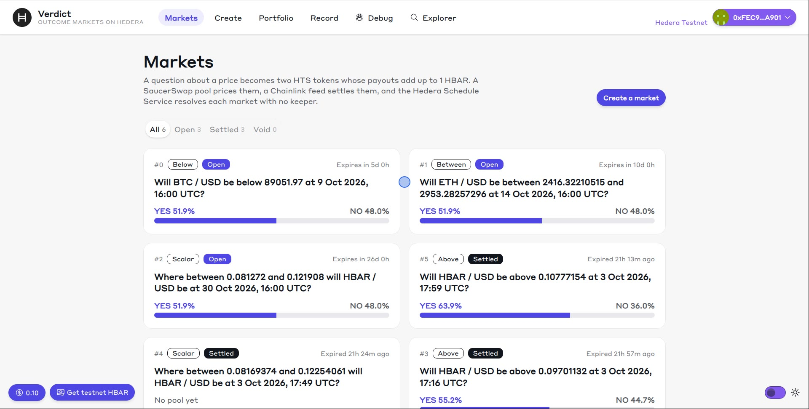

The home page lists every market on the reference deployment. Each card shows the question, the kind of market, whether it is open or settled, the time to expiry, and the odds from its pool. The tabs above the cards filter by status.

## 2. See how a market settles

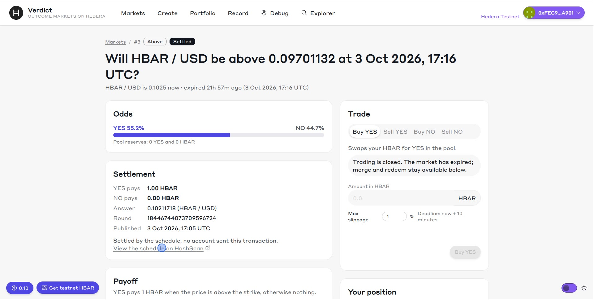

Open a settled market. The Settlement panel shows what YES and NO pay, the Chainlink answer that decided it, and the exact price round used: the one that was current at the second the market expired. The line "Settled by the schedule, no account sent this transaction" means the market booked its own settlement with the Hedera Schedule Service (HSS) when it was created, and the network ran it on time. Nobody had to run a bot or a server.

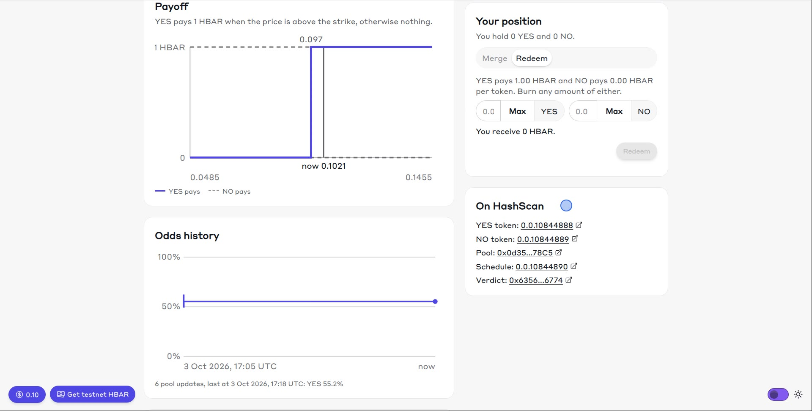

Every token, pool and schedule links to HashScan, Hedera's public explorer, so each step can be checked on the ledger.

## 3. Read an open market

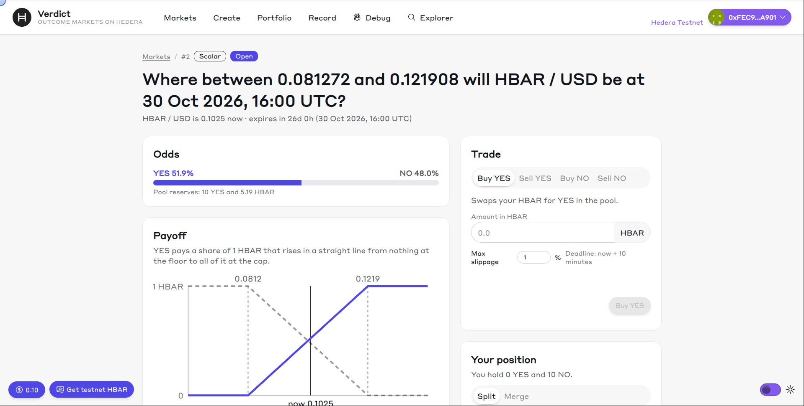

An open market shows the current odds and pool reserves, a payoff diagram (what YES and NO pay across the price range, with the current price marked) and the odds history, read from the pool's events through the mirror node.

## 4. Trade

These steps use the BTC / USD market and the burner wallet, which the app connects automatically on testnet.

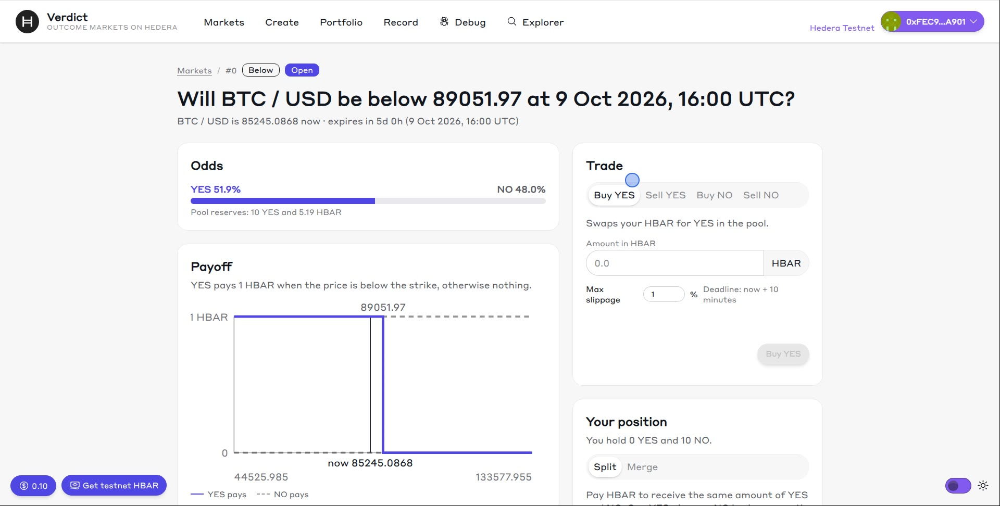

**Buy YES.** Pick Buy YES, type an amount of HBAR, and the panel shows how much YES you will get after the pool's fee. Confirm, and the router swaps through the SaucerSwap pool in one transaction, protected by a slippage limit and a deadline.

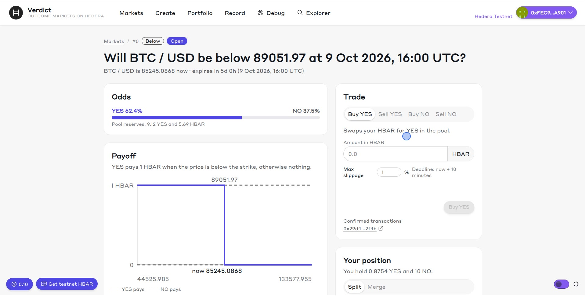

**Sell YES.** The first time, the app asks you to approve the router to take your YES. Then the sale swaps YES back to HBAR.

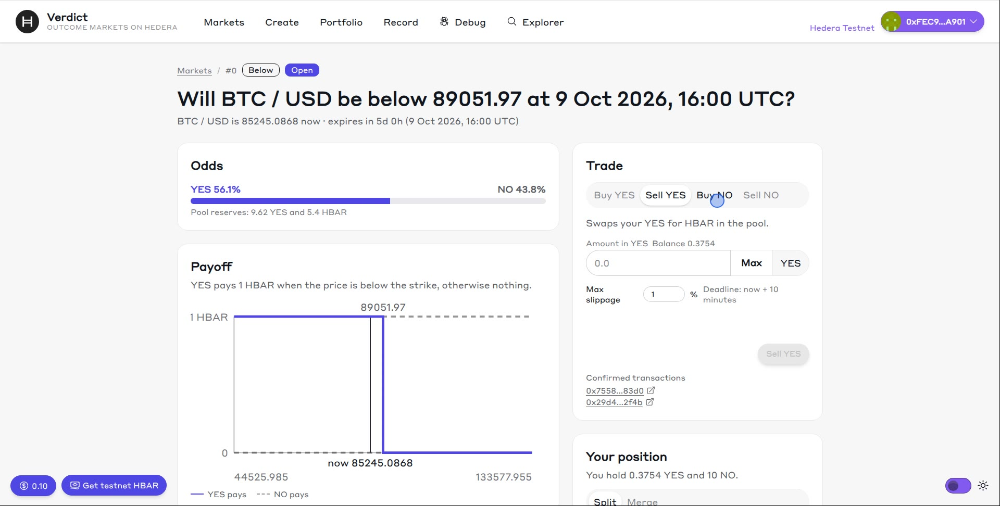

**Buy NO.** There is no NO pool. Buy NO splits your HBAR into YES and NO, keeps the NO for you and sells the YES leg, all in one transaction.

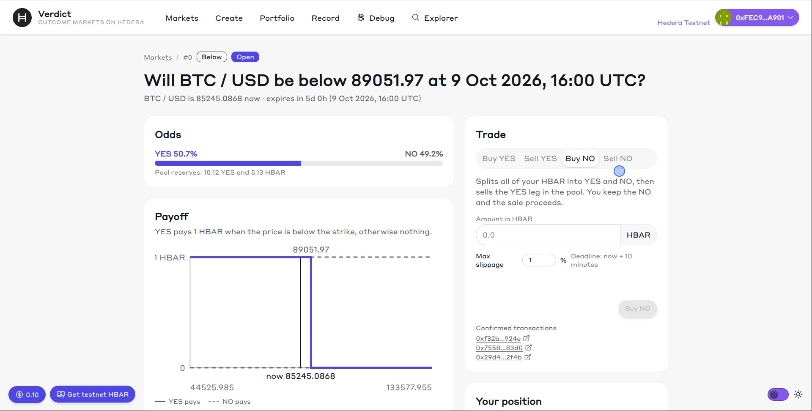

**Sell NO.** The reverse: the router buys the matching YES in the pool and merges the pair back into HBAR. You send a little HBAR to cover the YES, and anything unused comes back.

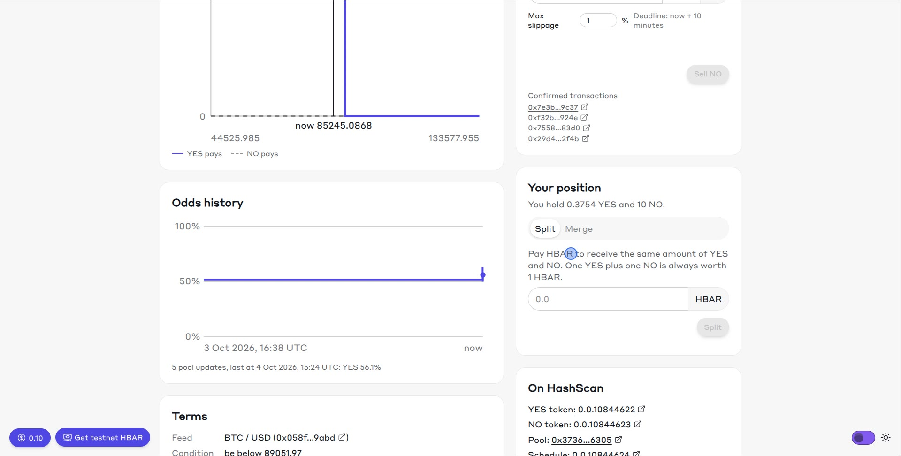

**Split and merge.** Split turns HBAR into the same amount of YES and NO. Merge turns pairs back into HBAR, at any time, even after the market settles.

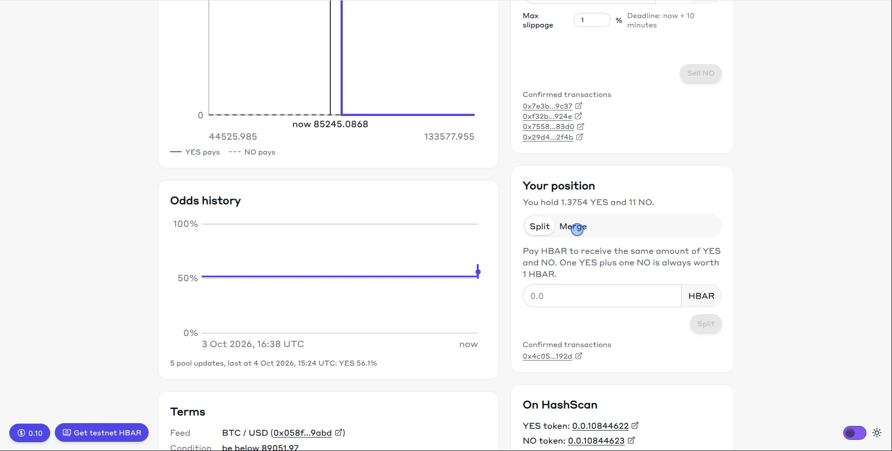

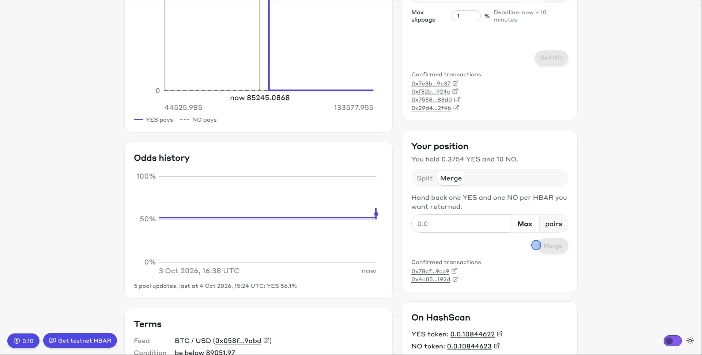

## 5. Create a market

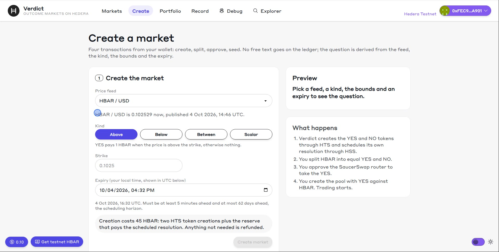

The Create page takes you through four wallet transactions in order: create, split, approve, seed.

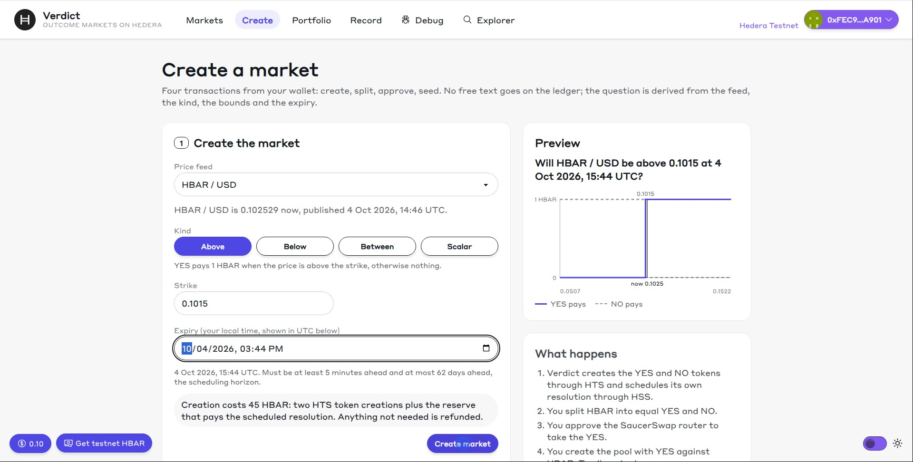

Pick a price feed, a kind, a strike and an expiry (at least 5 minutes ahead). The question is generated from those choices, so no free text is written to the ledger. The page shows the cost before you sign: 45 HBAR is sent, about 30 is used (mostly the two token creations, which Hedera prices in US dollars), and the rest is refunded.

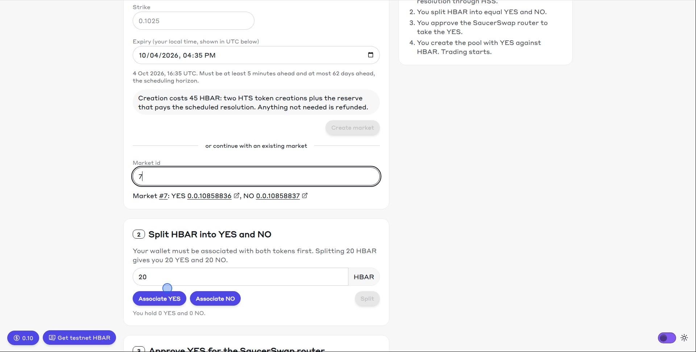

Creating the market is one transaction: the contract creates the YES and NO tokens on HTS and schedules its own settlement with HSS. Then associate your wallet with the two new tokens (one click each) and split some HBAR into YES and NO.

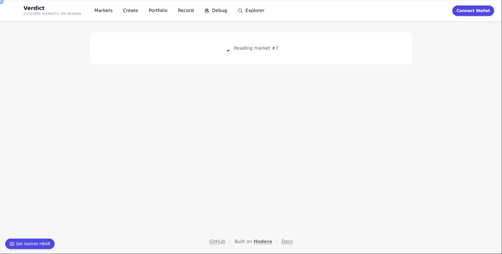

To seed the pool, choose its opening size (2 YES against 1 HBAR opens it at even odds), approve the SaucerSwap router to take the YES, and create the pool. Creating a pool pays SaucerSwap's fee of about 20 HBAR. Seeding leaves you holding the NO tokens, which is a position in its own right.

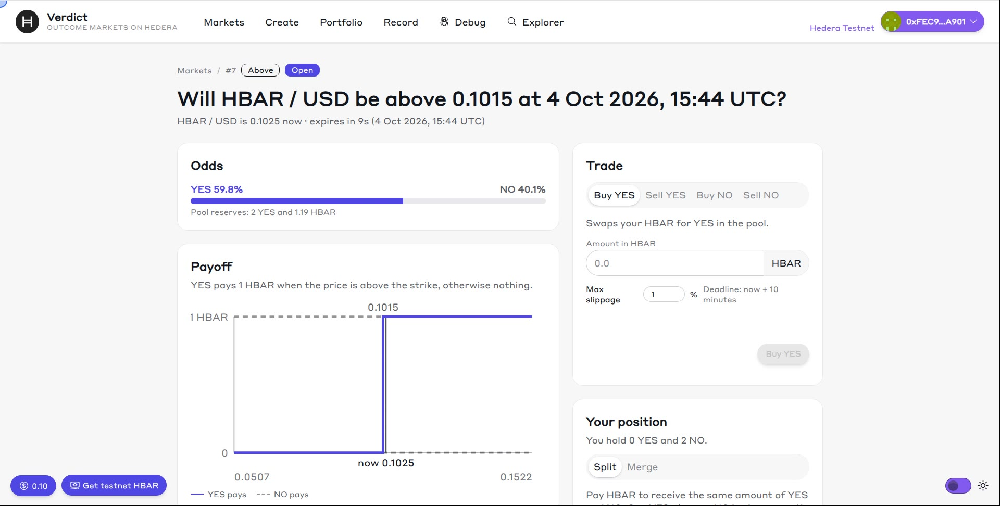

The new market is live, with odds from its own pool.

## 6. Settlement, redemption and the record

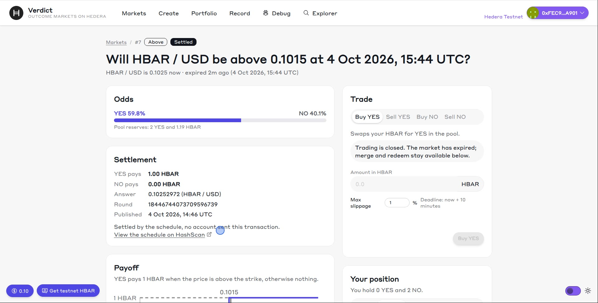

When the market expired, the Hedera Schedule Service ran its settlement on its own, within a second of the expiry. YES pays 1 HBAR here because the price finished above the strike.

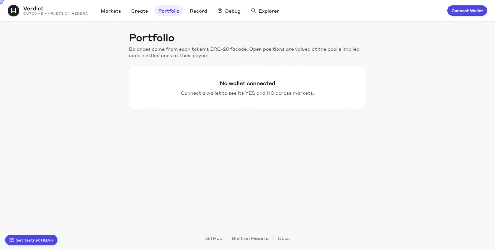

Redeeming burns your tokens for their payout. This scalar market settled halfway between its bounds, so each YES and each NO pays 0.5 HBAR. The app asks for approval first, because the contract takes the tokens to burn them.

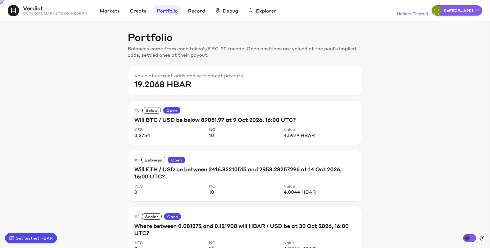

The portfolio shows your positions across markets, valued at current odds, with a redeem button for settled ones.

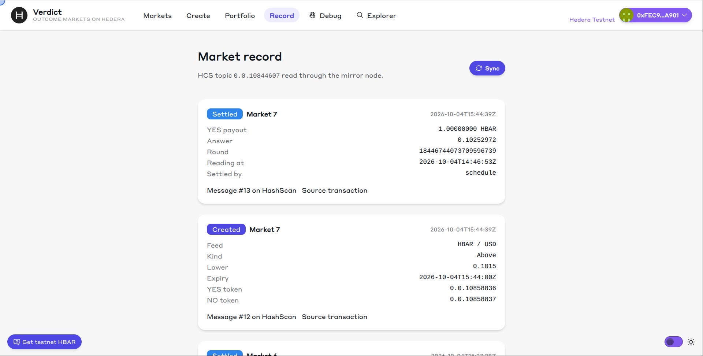

Every market's terms and settlement are written to a Hedera Consensus Service (HCS) topic, built from on-ledger events, and read back through the mirror node. The top two messages are the market created above and its settlement by the schedule.

## What this cost

The whole session above (four trades, split, merge, one new market with its pool, and a redemption) used about 90 HBAR of testnet funds. Most of that is the market creation (about 30 HBAR) and SaucerSwap's pool creation fee (about 20 HBAR). [COSTS.md](COSTS.md) has the measured cost of every step.
